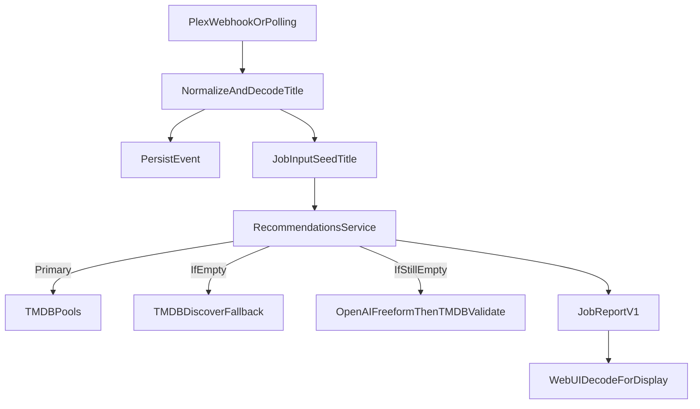

# Fix Plex title encoding and harden recommendations

## Scope

- **Fix title encoding** so Plex titles like `WALL·E` never flow through as `WALL&#183;E` (decode entities + normalize).
- **Improve recommendation resilience** so “Based on recently watched” doesn’t degrade into near-random results when TMDB pools are empty.
- **UI safety net** so historical job reports that already contain entities render cleanly.

## Implementation plan

### 1) Decode/normalize Plex titles at ingest (backend)

- Add a small shared utility (no new deps) to **decode numeric entities** (e.g. `&#183;`, `&#xB7;`) and optionally common named ones, then normalize unicode punctuation.
- Apply it at the two entry points where `seedTitle` originates:
  - [`apps/api/src/webhooks/plex-polling.service.ts`](apps/api/src/webhooks/plex-polling.service.ts) — normalize `title`, `showTitle`, etc before persisting and before triggering jobs.
  - [`apps/api/src/webhooks/webhooks.controller.ts`](apps/api/src/webhooks/webhooks.controller.ts) — normalize `title` / `grandparentTitle` pulled out of webhook payload.
- Add a **defensive decode** in the job layer so any legacy stored events still work:
  - [`apps/api/src/jobs/basedon-latest-watched-collection.job.ts`](apps/api/src/jobs/basedon-latest-watched-collection.job.ts)
  - [`apps/api/src/jobs/immaculate-taste-collection.job.ts`](apps/api/src/jobs/immaculate-taste-collection.job.ts)

### 2) Improve seed matching so TMDB pools don’t return `tmdbId: 0`

- In [`apps/api/src/tmdb/tmdb.service.ts`](apps/api/src/tmdb/tmdb.service.ts) (or where seed metadata is resolved), add a fallback: if seed lookup fails, try **query variants** (decoded title, punctuation-stripped, hyphen/dot replacements) and prefer year match.
- Ensure `getSplitRecommendationCandidatePools` uses the resolved seed id so genre + candidate pools aren’t empty.

### 3) Improve OpenAI behavior when TMDB can’t satisfy split

User-selected policy: **no-split-mode**.

- In [`apps/api/src/recommendations/recommendations.service.ts`](apps/api/src/recommendations/recommendations.service.ts), remove the strict “can satisfy split” gate. Instead:
  - Build a single ranked candidate list from released/upcoming/unknown.
  - Call OpenAI to select **N items** from the combined candidate list (no released/upcoming quotas).
- Update [`apps/api/src/openai/openai.service.ts`](apps/api/src/openai/openai.service.ts) (and types) to support this selection mode while keeping the current split-based method available for other flows if needed.
- Add explicit debug fields in the report payload:
  - `openAiMode: 'no_split' | 'split'`
  - `openAiSkipReason: 'disabled' | 'cooldown' | 'no_candidates' | 'error'`

### 4) Add ultimate fallbacks when TMDB pools are empty (both)

User-selected fallback: **TMDB discover first, then OpenAI freeform**.

- In [`apps/api/src/recommendations/recommendations.service.ts`](apps/api/src/recommendations/recommendations.service.ts):
  - If pools are empty after seed normalization, run a **TMDB Discover fallback** (genre/era based from seed metadata). Pick a deterministic top-N.
  - If still empty, run **OpenAI freeform fallback** (ask for similar titles), then **TMDB-validate** each result and take the best unique set.
- Include these in debug/report:
  - `fallbackUsed: 'none' | 'tmdb_discover' | 'openai_freeform'`
  - `fallbackCandidatesCount`, `fallbackTitles` (capped)

### 5) Frontend: render historical titles cleanly (web)

- Add a small `decodeHtmlEntities` helper and apply it when rendering report headline/facts so existing stored `&#...;` strings display correctly.
- Likely touch points:
  - [`apps/web/src/pages/JobRunDetailPage.tsx`](apps/web/src/pages/JobRunDetailPage.tsx) (report headline + facts)
  - [`apps/web/src/pages/RewindPage.tsx`](apps/web/src/pages/RewindPage.tsx) (summary snippets)

### 6) Verification

- Trigger a run with a known special-char title (e.g. `WALL·E`) and verify:
  - Seed title in logs/report is decoded.
  - TMDB seed metadata resolves (no `tmdbId: 0`).
  - If TMDB pools are empty, fallbacks activate and are reflected in debug.
  - UI displays both new and historical reports without showing `&#...;`.

## Diagram (high-level data flow)

