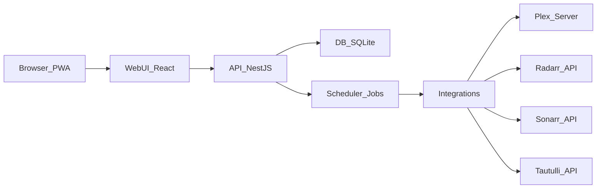

# Tautulli Curated Plex — Webapp Rewrite Plan

## Outcome

Build a **single local service** (NestJS API + React UI) that runs continuously, works well on **desktop + mobile**, and moves all configuration into the UI backed by a DB (with **import-from-YAML** onboarding).

- **MVP Job 1 (primary)**: **Monitor Confirm + Sonarr “Search Monitored”**
- **MVP Job 2 (secondary)**: **Recently Watched collections refresher**
- **Execution model**: **full TypeScript rewrite** (no Python runtime in the shipped app)

## What you already have (we’ll build on it)

- **Monorepo** with npm workspaces (`apps/api`, `apps/web`) and a combined dev command in root `package.json`.
- `apps/api` already serves the built UI via `ServeStaticModule` when `apps/web/dist` exists (`apps/api/src/app.module.ts`).
- `apps/web` already has an onboarding/testing UI that calls `/api/*` endpoints (`apps/web/src/App.tsx`), and Vite proxies `/api` to the backend (`apps/web/vite.config.ts`).
- Docker build already produces a single image serving API + UI (`docker/tautulli-curated-plex/*`).

## Guiding constraints

- Treat the legacy Python under `src/tautulli_curated/` as **read-only reference**. We port logic; we don’t depend on it at runtime.
- **No user-edited config files**: settings live in the DB, edited in UI. We support **import** from an existing YAML.

## Architecture (target)

- **API owns**: settings (DB), job execution + scheduling, job history/logs, integration clients.
- **UI owns**: onboarding wizard, settings forms, “run job” actions, job history/log viewer.

## Storage (SQLite first)

Use **SQLite by default** (file under `APP_DATA_DIR` like your webhook storage). Optional Postgres later.Suggested core tables/entities:

- **Settings**
- `IntegrationConfig`: Plex/Radarr/Sonarr/Tautulli/TMDB base URLs, library names, feature toggles.
- `Secret`: encrypted API keys/tokens.
- **Jobs**
- `JobDefinition` (static IDs: `monitorConfirm`, `recentlyWatchedRefresher`)
- `JobSchedule` (cron, enabled)
- `JobRun` (status, started/ended, summary JSON)
- `JobLogLine` (timestamp, level, message, context)
- **Collections (for refresher)**
- `Collection` (name/type)
- `CollectionItem` (title, plexRatingKey?, year?, addedAt)

## Secrets handling (practical + secure-enough)

- Introduce an app-level **master key** (env `APP_MASTER_KEY`) for encryption.
- For “no-config-file” UX, if `APP_MASTER_KEY` is missing we can **generate one once** and store it in the app-managed data directory (not user-edited), and document how to override it for backups/migrations.

## API surface (MVP)

Add endpoints that support UI + jobs without leaking secrets:

- **Settings**
- `GET /api/settings` (redacted)
- `PUT /api/settings` (update)
- `POST /api/settings/import-yaml` (upload YAML, preview mapping, then apply)
- `POST /api/settings/test/*` (plex-server, radarr, sonarr, tautulli)
- **Jobs**
- `POST /api/jobs/monitor-confirm/run?dryRun=true|false`
- `POST /api/jobs/recently-watched-refresher/run?dryRun=true|false`
- `GET /api/jobs/runs` + `GET /api/jobs/runs/:id`
- `GET /api/jobs/runs/:id/logs`

## UI (MVP)

Refactor `apps/web` from the single-page wizard into a small app shell:

- **Onboarding wizard** (keep the UX you already started, but persist to server DB)
- Plex token via PIN flow (already implemented) + add Plex server URL + library names.
- Radarr/Sonarr connection + tests.
- Tautulli connection (for later pipelines; minimal for refresher).
- Import-from-YAML option.
- **Pages**
- Dashboard (service health + next run times)
- Integrations/Settings
- Jobs (Run now / Dry run / schedule)
- Job run detail (summary + log viewer)

Make it responsive (mobile-first). PWA polish can be added once navigation/pages are stable.

## Implementation phases (concrete)

### Phase 1 — DB + settings + onboarding persistence

- Add SQLite DB, migrations, and a settings service.
- Change the existing onboarding flow to **save settings to the API** instead of `localStorage` secrets.
- Add YAML import: upload + map keys from `config/config.yaml` shape (`plex.*`, `radarr.*`, `sonarr.*`, `scripts_run.*`, etc.).

### Phase 2 — Job framework (runs, logs, scheduler)

- Add a jobs module with:
- job runner abstraction (dry-run + live)
- persisted job runs + log lines
- scheduler (dynamic cron from DB)

### Phase 3 — MVP Job 1: Monitor Confirm (Radarr + Sonarr + Plex) + Sonarr search

Port the logic from:

- `src/tautulli_curated/helpers/radarr_monitor_confirm.py`
- `src/tautulli_curated/helpers/sonarr_monitor_confirm.py`
- `src/tautulli_curated/helpers/sonarr_utils.py` (MissingEpisodeSearch)

Implementation notes:

- Extend `apps/api/src/radarr/radarr.service.ts` and `apps/api/src/sonarr/sonarr.service.ts` with real operations (list monitored, update monitored flags, trigger Sonarr MissingEpisodeSearch).
- Implement a Plex **server** client (separate from plex.tv auth) to:
- build a TMDB id set for movies
- build a TVDB->show index and per-show episode set
- UI: add “Dry run preview” and “Apply changes” with counts and a short list of affected items.

### Phase 4 — MVP Job 2: Recently Watched collections refresher

Port the core behavior from `src/tautulli_curated/helpers/recently_watched_collections_refresher.py`:

- randomize collection order
- remove + re-add items to Plex collection
- skip items not yet present in Plex

Store the collection item list in DB (rather than JSON files), but provide import/export compatibility if you want to reuse existing `data/*.json`.

### Phase 5 — Iterative port of remaining workflows

Duplicate cleaner, immaculate taste pipelines, refreshers, webhooks-driven triggers, health reporting, etc.

### Phase 6 — Packaging and distribution

- **Docker**: add a persistent volume for `APP_DATA_DIR` (DB, webhook logs, caches), multi-arch build later.
- **Desktop** (later): package the Node service to run in background and open `http://localhost:3210`.

## Files we’ll primarily touch/create

- API:
- `apps/api/src/app.module.ts` (add Settings/DB/Jobs modules)
- `apps/api/src/radarr/*`, `apps/api/src/sonarr/*`, `apps/api/src/plex/*` (extend)
- new: `apps/api/src/settings/*`, `apps/api/src/jobs/*`, `apps/api/src/db/*`
- Web:
- `apps/web/src/*` (split into pages/components; keep wizard UX but persist server-side)
- Docker: