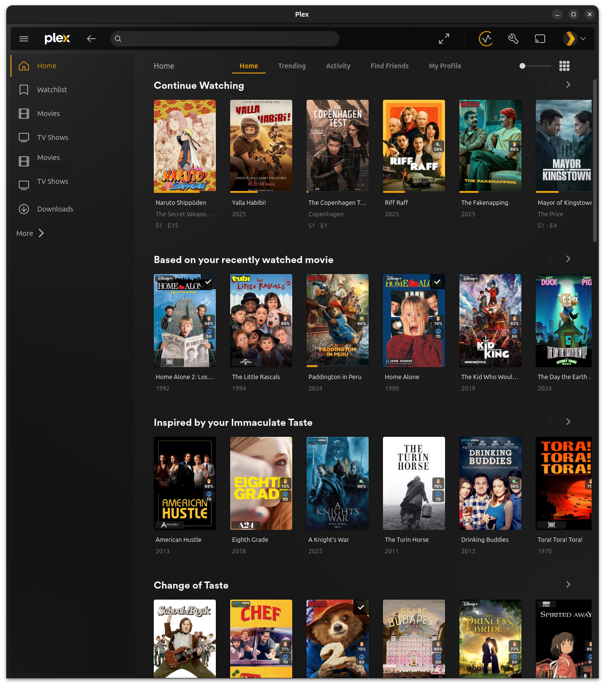

## Tautulli Curated Plex Collection

**Version:** 5.2.0

Python automation system that creates and maintains dynamic Plex collections based on your viewing habits (with optional OpenAI + optional Google context, and a TMDb fallback).

### Docs

- **Setup / usage**: [`docs/README.md`](docs/README.md)
- **Version history**: [`docs/VERSION_HISTORY.md`](docs/VERSION_HISTORY.md)

