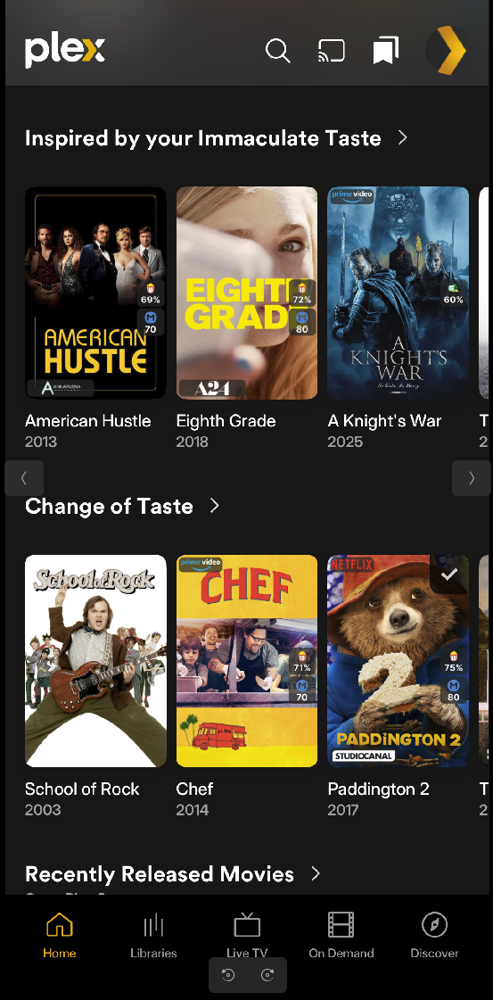
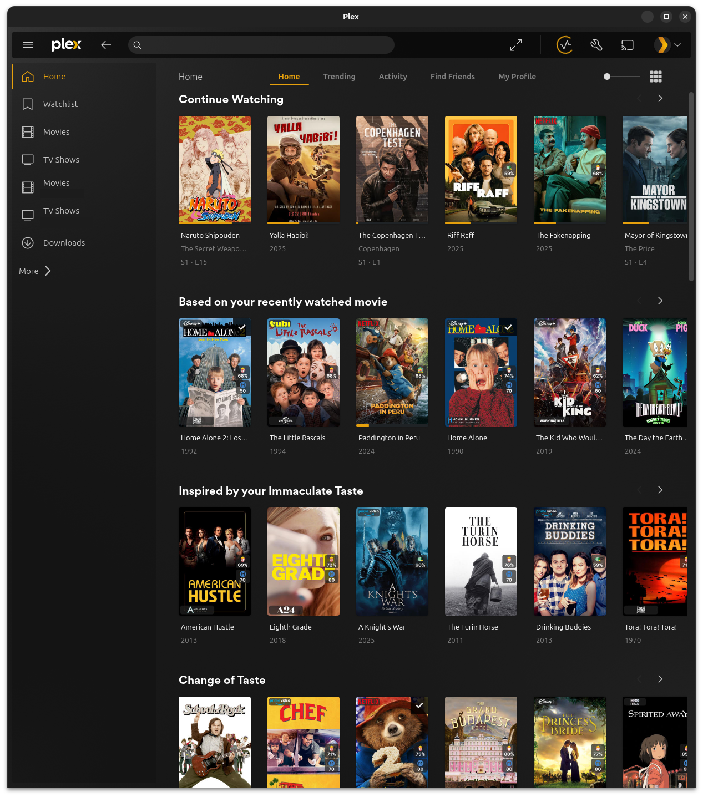
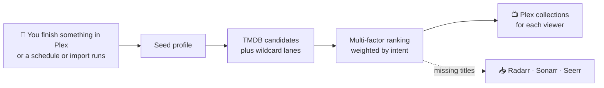

<div align="center">


**A Plex autopilot that watches what you watch, builds curated collections for every viewer, and
keeps your library tidy, without the babysitting.**

<sub>Self-hosted · one Docker container · Plex required · Radarr, Sonarr and Seerr optional</sub>

[](https://github.com/ohmzi/Immaculaterr/releases)
[](https://github.com/ohmzi/Immaculaterr/actions/workflows/publish-containers.yml)
[](https://github.com/ohmzi/Immaculaterr/pkgs/container/immaculaterr)
[](https://hub.docker.com/r/ohmzii/immaculaterr)
[](LICENSE)

[Features](#-features) · [Screenshots](#-screenshots) · [Quick start](#-quick-start) · [Docs](#-documentation) · [FAQ](doc/FAQ.md) · [Report a bug](https://github.com/ohmzi/Immaculaterr/issues)

</div>

---

## 👋 What is Immaculaterr?

Immaculaterr turns your Plex server into something closer to your own Netflix. Finish a movie or an
episode and fresh, personal recommendation rows appear on your Plex home screen. Behind the scenes it
fetches what's missing and clears out what nobody will ever watch.

- **🍿 Reacts to what you watch.** A finished movie or episode becomes new collections right away.
- **👥 Personal for every viewer.** Each monitored Plex user gets their own rows and their own
  history.
- **🎛️ You stay in control.** Observatory lets you swipe through suggestions before anything
  reaches Plex or your ARRs.
- **🧹 Keeps the library tidy.** Cutting Room finds media nobody will watch, with a dry run and
  one-click restore.
- **📦 One container.** A Docker image with a persisted queue, run history, and an optional HTTPS
  sidecar.

---

## 📸 Screenshots

<div align="center">
  
</div>

<details>
<summary><b>Mobile, and what it looks like in Plex</b></summary>
<br/>
<div align="center">
  
  
  <br/><br/>
  
</div>
</details>

---

## ✨ Features

### 🍿 Recommendations that follow your watching

- **Plex-triggered runs.** A finished movie or episode becomes fresh rows, pinned where each viewer
  can see them.
- **Binge-aware.** Later episodes of a show that already triggered a run are skipped, and the skip
  is recorded.
- **Collections:** *Based on your recently watched*, *Change of Taste*, *Inspired by your Immaculate
  Taste*, *Fresh Out Of The Oven*, and Netflix and Plex history picks.
- **Immaculate Taste profiles** with their own users, genre and audio-language filters, names, and
  download route.

### 🔭 Observatory

- Swipe right to approve and left to reject, one title at a time, before anything reaches Plex or
  Radarr/Sonarr.
- Works with touch, mouse, buttons, or arrow keys, and `Z` undoes the last card.

### ✂️ Cutting Room

- Scores every item on watch history, time in library, ratings, and who requested it, then prunes
  with a typed confirmation.
- Watchlists, continue-watching, recent requests, and your own high-rated titles are always
  protected. A dry run rehearses everything, and Restore re-downloads anything pruned.
- Companion cleaners for the Wanted list, duplicates, and oversized files.

### 📥 Fetch what's missing

- Send titles to Radarr and Sonarr directly, or through Seerr, chosen per task.
- Discovery jobs find upcoming releases from TMDB and Rotten Tomatoes, and send them where you choose.
- **Confirm Monitored** unmonitors a movie only once Plex can play it *and* Radarr has the file.

### 🧾 Runs you can trust

- Manual runs, schedules, Plex webhooks, and polling share one persisted queue that you can pause,
  cancel, or resume.
- **Rewind** shows live progress, reports, and logs. A failed run says so, with readable
  diagnostics.

### ⚡ Nice to live in

- `Ctrl/Cmd+K` search jumps to any page and finds FAQ answers too.
- Full mobile support, remembered filters, reduced motion, and custom collection posters.
- Netflix CSV and Plex history imports give recommendations a head start on day one.

> [!TIP]
> Every feature, collection, and cleaner is described in detail in
> **[doc/FEATURES.md](doc/FEATURES.md)**.

---

## 🧠 How it works


```mermaid
flowchart LR
    watch["🍿 You finish something in Plex<br/>or a schedule or import runs"] --> seed["Seed profile"]
    seed --> tmdb["TMDB candidates<br/>plus wildcard lanes"]
    tmdb --> rank["Multi-factor ranking<br/>weighted by intent"]
    rank --> plex["📺 Plex collections<br/>for each viewer"]
    rank -.->|"missing titles"| arr["📥 Radarr · Sonarr · Seerr"]
```

Candidates are ranked on similarity, quality, novelty, and popularity. Wildcard picks (global-language
films and hidden gems) are mixed in so the rows don't all look alike. More in
[doc/ARCHITECTURE.md](doc/ARCHITECTURE.md).

---

## 🚀 Quick start

```bash
docker run -d \
  --name Immaculaterr \
  -p 5454:5454 \
  -e HOST=0.0.0.0 \
  -e PORT=5454 \
  -e TZ=America/New_York \
  -e TRUST_PROXY=1 \
  -e APP_DATA_DIR=/data \
  -e DATABASE_URL=file:/data/tcp.sqlite \
  -v immaculaterr-data:/data \
  --restart unless-stopped \
  ghcr.io/ohmzi/immaculaterr:latest
```

Open `http://<server-ip>:5454/` and follow the setup wizard: create your admin login, then add your
Plex and TMDB keys. That's enough for collections. Then turn on Auto-Run in Task Manager.

- **Change `TZ`** to your own timezone.
- **Want HTTPS?** The Compose stack adds a Caddy sidecar on `:5464` with a trusted local
  certificate.
- **Serving it under a path** such as `/recommendations`? Set `APP_BASE_PATH`.

> [!IMPORTANT]
> The **[setup guide](doc/setupguide.md)** covers the recommended Compose install with HTTPS,
> reverse proxies and subpaths, plus [Unraid](doc/setup-unraid.md), [TrueNAS](doc/setup-truenas.md),
> and [updating](doc/setup-updating.md).

---

## 🔌 Integrations

| Service      | Required | Used for                                                          |
|--------------|:--------:|-------------------------------------------------------------------|
| **Plex**     | ✅       | The library it reads, builds collections in, and pins rows on     |
| **TMDB**     | ✅       | Metadata and recommendation candidates                            |
| **Radarr**   | ➖       | Fetching missing movies                                           |
| **Sonarr**   | ➖       | Fetching missing shows                                            |
| **Seerr**    | ➖       | A single request route instead of sending to Radarr/Sonarr        |
| **Tautulli** | ⬜       | Richer watch history for Cutting Room                             |
| **OpenAI**   | ⬜       | Widening or refining recommendation results                       |
| **Google**   | ⬜       | Widening or refining recommendation results                       |

✅ required · ➖ one of these to fetch missing titles · ⬜ optional

---

## 🛠️ Built with

<div align="center">


<br/>


<br/>


</div>

The full stack and the repository layout are in [doc/ARCHITECTURE.md](doc/ARCHITECTURE.md).

---

## 🔐 Security

- **Passwords** are hashed with Argon2id and never stored.
- **Sessions** live on the server. The browser only holds an encrypted, httpOnly cookie, and changing
  your password signs you out everywhere.
- **Integration keys** for Plex, Radarr, and Sonarr are encrypted at rest with AES-256-GCM.
- **Rate limits and a progressive lockout** protect sign-in. Strict security headers, origin checks,
  and deny-by-default CORS protect the API.
- **The container runs as a non-root user**, with `no-new-privileges` and owner-only data files.
- **Every PR** is gated on lint, build, tests (including security specs), and a production
  dependency audit.

> [!NOTE]
> The full list of protections is in **[doc/security-measures.md](doc/security-measures.md)**. To
> report a problem, see **[doc/security.md](doc/security.md)**.

---

## ❓ FAQ

<details>
<summary><b>Do I need Radarr, Sonarr, or Seerr?</b></summary>
<br/>

No. Plex and a TMDB key are enough to build collections. Radarr, Sonarr, or Seerr only come in when
you want missing titles fetched, and you choose the route per task.

</details>

<details>
<summary><b>Will it delete anything from my library?</b></summary>
<br/>

Only Cutting Room deletes files, and only after you review the candidates and type a confirmation.
Deletions go through Radarr/Sonarr, which keep each entry unmonitored and tagged
`deleted-by-immaculaterr`, so Restore can re-monitor and re-download it. A dry-run mode rehearses the
whole thing first.

</details>

More answers in the **[FAQ](doc/FAQ.md)**.

---

## 📚 Documentation

| Guide                                                  | What's in it                                                   |
|--------------------------------------------------------|----------------------------------------------------------------|
| 🚀 [setupguide.md](doc/setupguide.md)                  | Install with Compose or `docker run`, HTTPS, subpaths, secrets |
| 🧊 [setup-unraid.md](doc/setup-unraid.md)              | Unraid template and Compose setup                              |
| 🐟 [setup-truenas.md](doc/setup-truenas.md)            | TrueNAS SCALE custom app setup                                 |
| 🔄 [setup-updating.md](doc/setup-updating.md)          | Updating every kind of install, including Portainer            |
| ✨ [FEATURES.md](doc/FEATURES.md)                      | Every feature, collection, and cleaner in detail               |
| 🏗️ [ARCHITECTURE.md](doc/ARCHITECTURE.md)              | Recommendation engine, tech stack, repository layout           |
| ❓ [FAQ.md](doc/FAQ.md)                                | How each page and task behaves                                 |
| 🔐 [security-measures.md](doc/security-measures.md)    | Every protection, in plain terms                               |
| 📝 [Version_History.md](doc/Version_History.md)        | What changed in each release                                   |

---

## 🤝 Contributing

Thanks for wanting to help improve Immaculaterr.

- 🐞 **Found a bug?** [Open an issue](https://github.com/ohmzi/Immaculaterr/issues).
- 💡 **Have an idea?** [Suggest it](https://github.com/ohmzi/Immaculaterr/issues).
- 🔒 **Security concern?** See [doc/security.md](doc/security.md).

The source is public so you can inspect and verify it. Immaculaterr is not open source, so pull
requests and external patches are not accepted.

---

## 📄 License

Immaculaterr is distributed under custom terms. See [LICENSE](LICENSE).

- **Source code:** the public repository does not grant permission to use, copy, modify,
  redistribute, sublicense, or sell the source code without separate written permission.
- **Official Docker images and releases:** you may run the unmodified official artifacts for
  personal, noncommercial self-hosting. Redistribution, resale, derivative images, repackaging, and
  commercial use need separate written permission.

<div align="center">

<sub>Built for people who would rather watch something than manage a library · <a href="#top">Back to top ↑</a></sub>

</div>
