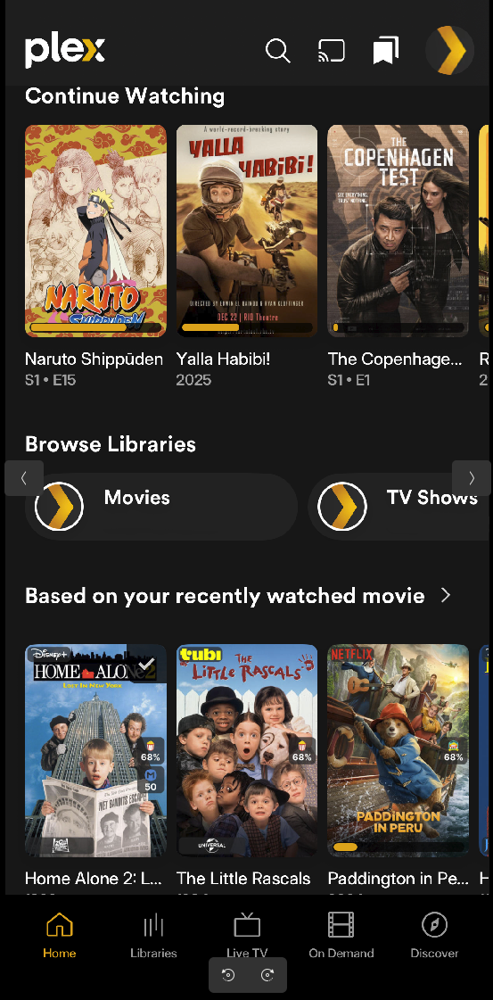

# Tautulli Curated Plex Collection

**Version:** 5.2.0

Python automation system that creates and maintains dynamic Plex collections based on your viewing habits. When you finish watching a movie, the system automatically generates intelligent recommendations, adds missing movies to Radarr, maintains multiple curated collections, and keeps your library synchronized.


## What Does It Do?

Tautulli Curated Plex Collection puts you in control of your media library by automatically creating and maintaining custom collections that make discovering your next favorite movie effortless. With intelligent AI-powered recommendations, automatic Radarr integration, and smart library management, you'll never run out of great content to watch.

When you finish watching a movie, the system:

- 🤖 **Generates intelligent recommendations** using optional OpenAI (with optional Google web-search context) and a mandatory TMDb fallback
- 📚 **Maintains multiple Plex collections:**
  - "Based on your recently watched movie" - Similar recommendations
  - "Change of Taste" - Contrasting recommendations (palate cleanser)
  - "Inspired by your Immaculate Taste" - Curated collection with points system
- ⬇️ **Adds missing movies to Radarr** for automatic download
- 🧹 **Cleans up duplicates** in your Plex library
- 🔄 **Synchronizes Radarr/Sonarr** monitoring with Plex library status
- 🎨 **Refreshes collections** by randomizing order for fresh presentation




## Quick Start

### Prerequisites

- **Plex Media Server** - Your media server
- **Tautulli** - For watching activity tracking
- **Radarr** - For automatic movie downloads
- **Sonarr** (Optional) - For TV show management
- **Python 3.8+** - Required runtime
- **TMDb API Key** (**Required**) - For movie metadata and fallback recommendations (**free**)
- **OpenAI API Key** (**Optional**) - For AI-powered recommendations (`gpt-5.2-chat-latest`) (**paid**, but typically costs very little)
- **Google API Key + Search Engine ID (cx)** (**Optional**) - Adds web search context to OpenAI (upcoming titles); used only when OpenAI is enabled (**free tier available**)

### Installation

1. **Clone or download this repository:**
   ```bash
   git clone https://github.com/yourusername/Tautulli_Curated_Plex_Collection.git
   cd Tautulli_Curated_Plex_Collection
   ```

2. **Install Python dependencies:**
   ```bash
   pip install -r docker/custom-tautulli/requirements.txt --user
   ```
   
   Or for system-wide installation:
   ```bash
   pip install -r docker/custom-tautulli/requirements.txt --break-system-packages
   ```

3. **Configure your settings:**
   
   Edit `config/config.yaml` with your credentials:
   ```yaml
   plex:
     url: "http://localhost:32400"
     token: "YOUR_PLEX_TOKEN"
     movie_library_name: "Movies"
   
   openai:
     api_key: "sk-proj-XXXXXXXXXXXXXXXXXXX"   # Optional (placeholder/blank disables OpenAI)
     model: "gpt-5.2-chat-latest"             # Optional (default: gpt-5.2-chat-latest)
   
   recommendations:
     count: 50                                # Optional (default: 50)
     web_context_fraction: 0.30               # Optional (default: 0.30). Bias toward web/upcoming titles (Google context + OpenAI merge)

   google:
     api_key: "GOOGLE_API_KEY"                # Optional (used only if OpenAI is enabled)
     search_engine_id: "GOOGLE_CSE_ID"        # Optional (Google Programmable Search Engine ID / cx)
     # Google context size is derived from: recommendations.count * recommendations.web_context_fraction
   
   radarr:
     url: "http://localhost:7878"
     api_key: "YOUR_RADARR_API_KEY"
     root_folder: "/path/to/Movies"
   
   tmdb:
     api_key: "YOUR_TMDB_API_KEY"             # REQUIRED (free)
   ```

   **Tip (recommended for public repos):**
   - Keep `config/config.yaml` as a safe template (no real keys)
   - Put your real secrets in `config/config.local.yaml` (auto-detected; should NOT be committed)

4. **Set up Tautulli automation:**
   - Open Tautulli → Settings → Notification Agents
   - Add a new **Script** notification agent
   - **Script File:** `src/tautulli_curated/main.py`
   - **Trigger:** Watched
   - **Arguments:** `"{title}" "{media_type}"`

5. **Enable scripts in config:**
   
   Edit `config/config.yaml` to enable/disable scripts:
   ```yaml
   scripts_run:
     run_recently_watched_collection: true
     run_plex_duplicate_cleaner: true
     run_radarr_monitor_confirm_plex: true
     run_immaculate_taste_collection: true
     run_recently_watched_refresher: true  # MANDATORY - adds to Plex
     run_collection_refresher: true        # MANDATORY - adds to Plex
   ```

That's it! The system will now automatically run whenever you finish watching a movie.

## Step-by-Step Guides

If you're new to Python, Tautulli automation, or this project, we've got detailed guides to help you get started:

### Local Installation Walkthrough

For users running the script directly on Windows, macOS, or Linux:

1. **Install Python 3.8+** from [python.org](https://www.python.org/downloads/)
2. **Install dependencies** (see Quick Start above)
3. **Configure `config/config.yaml`** with your API keys and service URLs
4. **Set up Tautulli notification** (see Quick Start above)
5. **Test the script** by watching a movie or manually triggering it

### Docker Installation Walkthrough

For users running in Docker containers:

1. **Build the custom Tautulli image:**
   ```bash
   docker build -f docker/custom-tautulli/Dockerfile -t tautulli_recommendations .
   ```

2. **Update your Tautulli container** to use this image

3. **Mount volumes** for `config/` and `data/` directories

4. **Configure** `config/config.yaml` in the mounted volume

5. **Set up Tautulli notification** pointing to the script in the container

See the [Docker Configuration](#docker-configuration) section for more details.

## Example Usage

Tautulli Curated Plex Collection gives you powerful automation that works behind the scenes. Here's what you can expect:

### Automatic Collection Management

After watching a movie, your collections are automatically updated:

- **"Based on your recently watched movie"** - Gets 15 similar recommendations
- **"Change of Taste"** - Gets 15 contrasting recommendations (try something different!)
- **"Inspired by your Immaculate Taste"** - Gets up to 50 curated recommendations with intelligent points system

### Smart Library Management

- **Duplicate Detection:** Automatically finds and removes duplicate movies, keeping the best quality
- **Radarr Sync:** Unmonitors movies already in Plex to prevent unnecessary downloads
- **Sonarr Sync:** Unmonitors episodes/seasons already in Plex (TV shows)

### Automatic Downloads

Missing movies are automatically added to Radarr with:
- Proper quality profiles
- Custom tags
- Automatic search triggered


**Optional Overseerr Integration:** For manual approval workflow, use the modified fork [https://github.com/ohmzi/overseerr](https://github.com/ohmzi/overseerr) which allows admins to approve their own requests.

## Features

### 🤖 AI-Powered Recommendations

- **Optional OpenAI:** Generates intelligent, contextual movie recommendations (default model: `gpt-5.2-chat-latest`)
- **Optional Google Web Context (CSE):** If configured, runs a quick web search first and feeds snippets into the OpenAI prompt (helps surface upcoming titles)
- **TMDb Required + Fallback:** TMDb is mandatory for metadata and advanced fallback recommendations if OpenAI is disabled/fails
- **Diverse Recommendations:** Mix of mainstream, indie, international, and arthouse films
- **Configurable Counts:** Adjust the overall suggestion count (see `recommendations.count` in config)

### 📚 Multiple Collection Types

- **Recently Watched Collections:**
  - Similar movies to what you just watched
  - Contrasting movies for a change of pace
- **Immaculate Taste Collection:**
  - Curated collection with intelligent points system
  - Maintains relevance over time
  - Prioritizes high-quality recommendations

### 🔄 Automatic Synchronization

- **Radarr Integration:** Adds missing movies automatically
- **Monitor Sync:** Keeps Radarr monitoring in sync with Plex
- **Sonarr Support:** Full TV show episode/season management
- **Duplicate Cleanup:** Removes duplicates, keeps best quality

### 🎨 Collection Management

- **Automatic Refresh:** Collections randomized on each update
- **Custom Artwork:** Automatic poster and background images
- **Smart Filtering:** Automatically filters out non-movie items
- **Performance Optimized:** Uses rating keys for fast Plex lookups

### 🛠️ Standalone Scripts

Run maintenance tasks independently:

- Collection refreshers (for large collections)
- Radarr/Sonarr monitor confirmation
- Duplicate cleaners
- Search triggers

See [Standalone Scripts](#standalone-scripts) section for details.

## Configuration

All configuration is done through `config/config.yaml`. Here are the key sections:

### Script Execution Control

Enable or disable individual scripts:

```yaml
scripts_run:
  run_recently_watched_collection: true    # Step 1: Recently Watched
  run_plex_duplicate_cleaner: true         # Step 2: Duplicate Cleaner
  run_radarr_monitor_confirm_plex: true    # Step 3: Radarr Sync
  run_immaculate_taste_collection: true    # Step 4: Main Collection
  run_recently_watched_refresher: true     # Step 5a: Apply to Plex (MANDATORY)
  run_collection_refresher: true           # Step 5b: Apply to Plex (MANDATORY)
```

### Plex Configuration

```yaml
plex:
  url: "http://localhost:32400"
  token: "YOUR_PLEX_TOKEN"
  movie_library_name: "Movies"
  tv_library_name: "TV Shows"
  collection_name: "Inspired by your Immaculate Taste"
  delete_preference: "largest_file"  # Options: smallest_file, largest_file, newest, oldest
  preserve_quality: []                # Example: ["4K", "1080p"]
```

### OpenAI Configuration

```yaml
openai:
  api_key: "sk-proj-XXXXXXXXXXXXXXXXXXX"     # Optional (blank/placeholder disables OpenAI)
  model: "gpt-5.2-chat-latest"               # Optional (default: gpt-5.2-chat-latest)
```

### Recommendations (Overall)

```yaml
recommendations:
  count: 50                                  # Optional (default: 50)
```

### Google Custom Search (Optional)

Google is used only to provide **web-search context** to OpenAI (it is skipped if OpenAI is disabled).

```yaml
google:
  api_key: "GOOGLE_API_KEY"                  # Optional (set real key to enable)
  search_engine_id: "GOOGLE_CSE_ID"          # Optional (Programmable Search Engine ID / cx)
  num_results: 5                             # Optional (default: 5; max: 10)
```

### Radarr Configuration

```yaml
radarr:
  url: "http://localhost:7878"
  api_key: "YOUR_RADARR_API_KEY"
  root_folder: "/path/to/Movies"
  tag_name: "recommended"  # Or ["tag1", "tag2"] for multiple tags
  quality_profile_id: 1
```

### Sonarr Configuration

```yaml
sonarr:
  url: "http://localhost:8989"
  api_key: "YOUR_SONARR_API_KEY"
  root_folder: "/path/to/TV Shows"
  tag_name: "recommended"  # Or ["tag1", "tag2"] for multiple tags
  quality_profile_id: 1
```

### TMDb Configuration

TMDb is **mandatory** because it is used for metadata + recommendation fallback (especially when OpenAI/Google are not configured). TMDb is **free** to use (you just need an API key).

```yaml
tmdb:
  api_key: "YOUR_TMDB_API_KEY"               # REQUIRED
```

See [Configuration Options](#configuration-options) section for complete details.

## Standalone Scripts

The project includes several standalone bash scripts that can be run independently of the main Tautulli-triggered workflow. These are perfect for:

- Running collection refreshers during off-peak hours
- Periodic maintenance tasks
- Manual synchronization
- Scheduled automation via cron

### Available Scripts

#### Collection Refreshers

- **`run_recently_watched_collections_refresher.sh`** - Refreshes "Recently Watched" and "Change of Taste" collections
- **`run_immaculate_taste_refresher.sh`** - Refreshes "Immaculate Taste" collection

#### Maintenance Scripts

- **`run_radarr_monitor_confirm.sh`** - Syncs Radarr monitoring with Plex
- **`run_sonarr_monitor_confirm.sh`** - Syncs Sonarr monitoring with Plex
- **`run_radarr_search_monitored.sh`** - Triggers search for monitored movies
- **`run_sonarr_search_monitored.sh`** - Triggers search for monitored episodes

#### Cleanup Scripts

- **`run_radarr_duplicate_cleaner.sh`** - Removes duplicate movies (and unmonitors in Radarr)
- **`run_sonarr_duplicate_cleaner.sh`** - Removes duplicate TV episodes

### Script Options

All scripts support these options:

- `--dry-run` - Show what would be done without making changes
- `--verbose` - Enable debug-level logging
- `--no-pause` - Don't pause at the end (for automated runs)
- `--log-file` - Save output to timestamped log file
- `--help` - Show help message

### Scheduling Scripts

#### Ubuntu/Linux (Cron)

```bash
# Edit crontab
crontab -e

# Add entries (example: run refreshers daily at 2 AM and 3 AM)
0 2 * * * /path/to/project/src/scripts/run_recently_watched_collections_refresher.sh --no-pause --log-file
0 3 * * * /path/to/project/src/scripts/run_immaculate_taste_refresher.sh --no-pause --log-file
```

#### Windows Task Scheduler

1. Open Task Scheduler (`Win + R` → `taskschd.msc`)
2. Create Basic Task
3. Set trigger (e.g., Daily at 2:00 AM)
4. Set action to run your script
5. Configure for automated execution

See [Scheduling Scripts](#scheduling-scripts) section for detailed instructions.

## Architecture & Flow

### Entry Point

The main script `src/tautulli_curated/main.py` is triggered by Tautulli when a movie is watched. It accepts:
- Movie title (from Tautulli)
- Media type (should be "movie")

**Note:** The script automatically skips execution if media type is not "movie" (e.g., episodes or shows).

### Execution Pipeline

The script executes in the following order (each step can be enabled/disabled via config):

1. **Recently Watched Collection** - Generates similar and contrasting recommendations
2. **Plex Duplicate Cleaner** - Removes duplicate movies
3. **Radarr Monitor Confirm** - Syncs Radarr with Plex
4. **Immaculate Taste Collection** - Main recommendation pipeline with points system
5. **Collection Refreshers** - **MANDATORY** - These actually add movies to Plex!

### How It Works

1. **Tautulli detects** you finished watching a movie
2. **Script is triggered** with movie title and media type
3. **Recommendations generated** using OpenAI GPT (with TMDb fallback)
4. **Plex library checked** for existing recommendations
5. **Missing movies added** to Radarr automatically
6. **Collections updated** in Plex with randomized order
7. **Library synchronized** (duplicates cleaned, monitoring synced)

See [Architecture & Flow](#architecture--flow) section for complete details.

## Logging & Monitoring

All script executions are automatically logged for debugging and monitoring.

### Automatic Logging

**Tautulli Main Script:**
- Automatically creates log file for every execution
- Log files: `tautulli_main_YYYYMMDD_HHMMSS.log`
- Location: `data/logs/`
- Contains complete execution details

**Standalone Scripts:**
- Use `--log-file` option to enable logging
- Creates timestamped logs: `script_name_YYYYMMDD_HHMMSS.log`
- Stored in `data/logs/`

### Viewing Logs

```bash
# View latest Tautulli execution log
ls -t data/logs/tautulli_main_*.log | head -1 | xargs cat

# View all logs from today
ls data/logs/*$(date +%Y%m%d)*.log

# Monitor logs in real-time
tail -f data/logs/tautulli_main_*.log
```

See [Logging & Monitoring](#logging--monitoring) section for complete details.

## Displaying Collections on Plex Home Screen

These scripts **automatically** publish the curated collections as recommendation rows on both **Home** and the library **Recommended** tab, and pin them to the **very top** of your Movies library in this order:

1. "Based on your recently watched movie"
2. "Inspired by your Immaculate Taste"
3. "Change of Taste"

**Notes:**
- **No manual Plex UI steps required** (no need to click “Visible on” or drag rows).
- **Friends’ Home** is left disabled by default.
- Plex clients may take a minute to refresh; if you don’t see changes immediately, refresh the client or wait briefly.

See [Displaying Collections on Plex Home Screen](#displaying-collections-on-plex-home-screen) section for detailed instructions.

## Project Structure

```
Tautulli_Curated_Plex_Collection/
├── assets/
│   └── collection_artwork/          # Custom collection artwork
├── config/
│   └── config.yaml                  # Configuration file
├── data/                            # Generated data files
│   ├── recommendation_points.json
│   ├── recently_watched_collection.json
│   ├── change_of_taste_collection.json
│   ├── tmdb_cache.json
│   └── logs/                        # Execution logs
├── src/
│   ├── tautulli_curated/            # Main Python package
│   │   ├── main.py                  # Main entry point
│   │   └── helpers/                 # Helper modules
│   └── scripts/                     # Executable bash scripts
├── docker/
│   └── custom-tautulli/             # Docker configuration
├── docs/
│   └── README.md                    # This file
└── sample_run_pictures/              # Screenshots and examples
```

See [Project Structure](#project-structure) section for complete details.

## Requirements

### Core Services

- **Plex Media Server** - Your media server
- **Tautulli** - For watching activity tracking
- **Radarr** - For automatic movie downloads
- **Sonarr** (Optional) - For TV show management
- **Overseerr** (Optional) - For manual approval workflow ([modified fork](https://github.com/ohmzi/overseerr) required)

### APIs

- **TMDb API Key** - **Required** for movie lookups and fallback recommendations
- **OpenAI API Key** - Optional (enables AI recommendations)
- **Google API Key + Search Engine ID (cx)** - Optional (adds web context to OpenAI; used only when OpenAI is enabled)

### Python Dependencies

All dependencies are listed in `docker/custom-tautulli/requirements.txt`:

- `requests` - API calls
- `PyYAML` - Configuration
- `plexapi` - Plex integration
- `openai` - GPT recommendations
- `tmdbv3api` - TMDb integration
- `arrapi` - Radarr/Sonarr integration

Install with:
```bash
pip install -r docker/custom-tautulli/requirements.txt --user
```

## Troubleshooting

### Common Issues

**Script not running from Tautulli:**
- Check Tautulli logs for errors
- Verify script path is correct
- Ensure Python is in PATH
- Check file permissions

**Collections not updating:**
- Ensure refresher scripts are enabled (`run_recently_watched_refresher: true`, `run_collection_refresher: true`)
- Check logs in `data/logs/`
- Verify Plex token is valid
- Check collection names match config

**Movies not being added to Radarr:**
- Verify Radarr API key and URL
- Check root folder path is correct
- Ensure quality profile ID exists
- Check Radarr logs

**Import errors in cron:**
- Install dependencies with `--user` flag
- Scripts automatically detect user-installed packages
- Check cron environment variables

### Getting Help

1. **Check the logs** in `data/logs/` for detailed error messages
2. **Review configuration** in `config/config.yaml`
3. **Test scripts manually** before scheduling
4. **Check Tautulli logs** for notification agent errors

## Version History

Full changelog: [VERSION_HISTORY.md](VERSION_HISTORY.md)

### Version 5.2.0 (Current)
- Weekly health monitoring: parses logs, writes `data/health/*.json`, and emails a mobile-friendly weekly report (Gmail App Password).
- Logging/monitoring improvements: better “what happened” excerpts, expected-script coverage, and missing-run detection.

### Version 5.1.0
- Cron/runtime hardening + better logging for cron/Tautulli execution.
- Plex UX + recommendations upgrades (auto-pin curated rows; Google CSE → OpenAI context; config improvements).

### Version 5.0.0
- Sonarr TV show support: duplicate cleaner, monitor confirm, and “search monitored” automation.
- Main pipeline orchestration expanded to include Sonarr steps.

### Version 4.1.0
- Collection correctness/performance improvements (better ordering + skip non-movie media).
- Radarr improvements (multiple tags support) + refresher robustness updates.

### Version 4.0.0
- Major multi-collection overhaul: Recently Watched + Change of Taste + Immaculate Taste + maintenance steps.
- Added retry/backoff + error handling improvements; new standalone scripts.

### Version 3.0.0
- Project restructuring into `src/tautulli_curated/` package + standardized folders (`config/`, `data/`, `docs/`, `docker/`).
- Added standalone runner scripts under `src/scripts/`.

### Version 2.0.0
- Introduced modular helpers (OpenAI/TMDb/Plex/Radarr) + a proper config loader and logging.
- Added `tautulli_immaculate_taste_collection.py` as the primary entry point.

### Version 1.0.0
- Initial public release (early README + initial automation scripts).
- Foundation for later modular pipeline work.

## Contributing

Pull requests are welcome! Please:

1. Fork the repository
2. Create a feature branch
3. Make your changes
4. Test thoroughly
5. Submit a pull request

## License

This project is provided "as is" without warranty of any kind. You are free to use, modify, and distribute this code as per the [MIT License](https://opensource.org/licenses/MIT).

---

## Detailed Documentation

For more detailed information, see the sections below:

- [Architecture & Flow](#architecture--flow) - How the system works
- [Features](#features) - Complete feature list
- [Installation & Setup](#installation--setup) - Detailed setup instructions
- [Standalone Scripts](#standalone-scripts) - All available scripts
- [Configuration Options](#configuration-options) - Complete configuration reference
- [Logging & Monitoring](#logging--monitoring) - Logging details
- [Expected Results](#expected-results) - What to expect after setup
- [Displaying Collections on Plex Home Screen](#displaying-collections-on-plex-home-screen) - Plex setup guide
- [Project Structure](#project-structure) - File organization
- [Version History](VERSION_HISTORY.md) - Complete changelog

---

**Now whenever Tautulli detects that a user has finished watching a movie, it will trigger your script with the movie's title. The system will generate recommendations, update collections, clean duplicates, sync Radarr, and refresh your Plex collections automatically.**

**Tip: Add the collections to your Home screen and position them at the very top—right beneath the Continue Watching list.**

**Enjoy using this script! I hope it enhances your movie selection. If you encounter any issues or have ideas for enhancements, feel free to open an issue or submit a pull request.**

---

## Architecture & Flow

### Entry Point

The main script `src/tautulli_curated/main.py` (or `tautulli_immaculate_taste_collection.py` for backward compatibility) is triggered by Tautulli when a movie is watched. It accepts two arguments:
- Movie title (from Tautulli)
- Media type (should be "movie")

**Note:** The script automatically skips execution if the media type is not "movie" (e.g., episodes or shows). When an episode is watched, the script will log a skip message and exit immediately without running any sub-scripts.

### Execution Pipeline

The script executes in the following order (each step can be enabled/disabled via config):

#### **Step 1: Recently Watched Collection** (if enabled)
- Generates up to 15 similar movie recommendations using OpenAI
- Generates up to 15 contrasting movie recommendations ("Change of Taste")
- Checks Plex library for each recommendation
- Adds missing movies to Radarr
- Saves recommendations to JSON files:
  - `data/recently_watched_collection.json`
  - `data/change_of_taste_collection.json`

#### **Step 2: Plex Duplicate Cleaner** (if enabled)
- Scans entire Plex library for duplicate movies (by TMDB ID)
- Removes lower quality duplicates based on your preferences
- Unmonitors movies in Radarr after deletion to prevent re-download
- Respects quality preservation settings (e.g., keep 4K files)

#### **Step 3: Radarr Monitor Confirm** (if enabled)
- Checks all monitored movies in Radarr
- Unmonitors movies that already exist in Plex
- Prevents unnecessary downloads and keeps Radarr in sync

#### **Step 4: Immaculate Taste Collection** (if enabled)
- Main recommendation pipeline with points system
- Generates up to 50 recommendations using OpenAI (with TMDb fallback)
- Checks Plex library for each recommendation
- Adds missing movies to Radarr
- Updates points system:
  - New recommendations: +1 point
  - Existing items: points maintained
  - Items with 0 or negative points: removed from collection
- Saves points data to `data/recommendation_points.json`

#### **Step 5: Collection Refreshers** (MANDATORY - if enabled)
These scripts **actually add movies to Plex collections**. Without them, movies are only saved to JSON files but never appear in Plex!

- **Recently Watched Collection Refresher:**
  - Reads `data/recently_watched_collection.json` and `data/change_of_taste_collection.json`
  - Uses rating keys for fast, direct Plex lookups (same as Immaculate Taste refresher)
  - Randomizes movie order
  - Removes all items from both Plex collections
  - Adds all movies back in randomized order
  - **Applies custom order** to ensure randomized order is displayed in Plex
  - Filters out non-movie items (clips, shows, etc.)

- **Immaculate Taste Collection Refresher:**
  - Reads `data/recommendation_points.json`
  - Builds tiered ordering: Top 3 items are randomly selected (1 from each tier: high/mid/low points) and shuffled
  - All remaining items are completely randomized (no points-based sorting)
  - Removes all items from the Plex collection
  - Adds all movies back in the randomized order

**Note:** These refreshers are **mandatory by default** (`true`) because they apply the collections to Plex. You can set them to `false` to run independently during off-peak hours.

---

## Features

### **Dual Collection System**
- **Recently Watched Collections:**
  - "Based on your recently watched movie" - Movies similar to what you just watched
  - "Change of Taste" - Movies that offer a different experience (palate cleanser)
  
- **Immaculate Taste Collection:**
  - Curated collection with intelligent points system
  - Maintains relevance over time
  - Prioritizes high-quality recommendations

### **GPT Recommendations**
- Uses OpenAI GPT to generate intelligent movie suggestions
- Includes mix of mainstream, indie, international, and arthouse films
- TMDb fallback if OpenAI is unavailable
- Configurable recommendation counts per collection

### **Plex Integration**
- Server-side search for fast lookups
- Normalizes titles for accurate matching
- Maintains multiple dedicated collections
- Automatic duplicate detection and cleanup

### **Radarr Automation**
- Adds missing movies to Radarr automatically
- Uses TMDb ID for accurate matching
- Configurable root folder, quality profile, and tags
- Automatically triggers search for newly added movies
- Monitors/unmonitors movies based on Plex library status
- **Optional Overseerr Integration:** For users who want manual approval before movies are downloaded, you can use the modified Overseerr fork that allows admins to approve their own requests: [https://github.com/ohmzi/overseerr](https://github.com/ohmzi/overseerr) (Note: The original Overseerr doesn't allow admins to approve their own requests)

### **Points System** (Immaculate Taste Collection)
- New recommendations get +1 point per run
- Points persist across runs
- Collection maintains all movies with their current points
- Automatic cleanup of items with 0 or negative points
- **Collection Ordering:** Top 3 items are randomly selected from high/mid/low point tiers and shuffled. All remaining items are completely randomized for fresh presentation on each refresh.

### **Duplicate Management**
- Scans entire library for duplicate movies
- Removes duplicates based on quality preferences
- Preserves high-quality files (configurable)
- Unmonitors in Radarr after deletion

### **Radarr Synchronization**
- Keeps Radarr monitoring status in sync with Plex
- Unmonitors movies already in Plex
- Prevents unnecessary downloads

### **Collection Refreshers**
- **MANDATORY** - These actually add movies to Plex!
- Randomizes collection order for fresh presentation
- Can run automatically or independently during off-peak hours
- Handles large collections gracefully
- Filters non-movie items automatically
- **Custom Artwork:** Automatically sets custom posters and backgrounds for collections

### **YAML Configuration**
- All settings in one place (`config/config.yaml`)
- Script execution control at the top
- Clear documentation and examples
- Type-safe configuration with dataclasses

### **Structured Logging**
- Step-based logging with timing information
- Clear execution flow visibility
- Detailed error messages and troubleshooting
- Summary statistics for each script

---

## Installation & Setup

### 1. Prerequisites

- **Plex, Tautulli, and Radarr** must already be installed and working.
- You'll need valid credentials for each service (tokens, API keys, etc.).
- **Python 3.8+** must be installed.

### 2. Install Python Dependencies

Install all required Python packages:

```bash
cd /path/to/tautulli_immaculate_taste_collection
pip install -r docker/custom-tautulli/requirements.txt --break-system-packages
```

Or for user installation (recommended for cron environments):

```bash
pip install -r docker/custom-tautulli/requirements.txt --user
```

**Important for Cron:** The scripts automatically detect and use user-installed packages (in `~/.local/lib/python3.x/site-packages`), so user installation works perfectly with cron jobs.

### 3. Prepare Your `config.yaml`

1. Create or edit `config/config.yaml` in the project with your real credentials:

```yaml
# ============================================================================
# SCRIPT EXECUTION CONTROL (All Optional - defaults shown)
# ============================================================================
scripts_run:
  run_recently_watched_collection: true    # OPTIONAL: Step 1 - Recently Watched Collection (default: true)
  run_plex_duplicate_cleaner: true         # OPTIONAL: Step 2 - Plex Duplicate Cleaner (default: true)
  run_sonarr_duplicate_cleaner: true       # OPTIONAL: Sonarr Duplicate Cleaner (default: true)
  run_radarr_monitor_confirm_plex: true    # OPTIONAL: Step 3 - Radarr Monitor Confirm (default: true)
  run_sonarr_monitor_confirm_plex: true    # OPTIONAL: Sonarr Monitor Confirm (default: true)
  run_sonarr_search_monitored: true        # OPTIONAL: Sonarr Search Monitored (default: true)
  run_immaculate_taste_collection: true    # OPTIONAL: Step 4 - Immaculate Taste Collection (default: true)
  run_recently_watched_refresher: true    # OPTIONAL: Step 5a - Recently Watched Refresher (default: true, MANDATORY for collections to appear in Plex)
  run_collection_refresher: true           # OPTIONAL: Step 5b - Immaculate Taste Refresher (default: true, MANDATORY for collection to appear in Plex)

# ============================================================================
# PLEX CONFIGURATION (Required fields marked)
# ============================================================================
plex:
  url: "http://localhost:32400"            # REQUIRED: Your Plex server URL
  token: "YOUR_PLEX_TOKEN"                 # REQUIRED: Your Plex authentication token
  movie_library_name: "Movies"             # REQUIRED: Name of your Plex movie library
  tv_library_name: "TV Shows"              # REQUIRED: Name of your Plex TV library (required for Sonarr scripts)
  collection_name: "Inspired by your Immaculate Taste"  # REQUIRED: Name of the main collection
  delete_preference: "largest_file"        # OPTIONAL: Which duplicate file to delete (default: "smallest_file")
                                           #           Options: smallest_file, largest_file, newest, oldest
  preserve_quality: []                     # OPTIONAL: List of quality keywords to preserve (default: [])
                                           #           Example: ["4K", "1080p"] to preserve high quality
  randomize_collection: true               # OPTIONAL: Randomize collection order (default: true)

# ============================================================================
# OPENAI CONFIGURATION (All Optional)
# ============================================================================
# If api_key is blank/placeholder, OpenAI is disabled and TMDb fallback is used.
openai:
  api_key: "sk-proj-XXXXXXXXXXXXXXXXXXX"  # OPTIONAL: OpenAI API key (blank/placeholder disables OpenAI)
  model: "gpt-5.2-chat-latest"             # OPTIONAL: OpenAI model (default: "gpt-5.2-chat-latest")
                                           #           Cost note: OpenAI is paid, but typically costs very little for this use-case

# ============================================================================
# RECOMMENDATION SETTINGS (All Optional)
# ============================================================================
recommendations:
  count: 50                                 # OPTIONAL: Number of total suggestions per run (default: 50)
                                           #           Used by both OpenAI (if enabled) and TMDb fallback
  web_context_fraction: 0.30              # OPTIONAL: Controls how much final recommendations can be influenced by web context (default: 0.30)
                                           #           - Controls how many Google CSE results are fetched (derived from count * web_context_fraction)
                                           #           - Max portion of final titles allowed from OpenAI's "upcoming_from_search" list

# ============================================================================
# GOOGLE CUSTOM SEARCH (All Optional)
# ============================================================================
# Used only to add web-search context to OpenAI (skipped if OpenAI is disabled).
# Google does NOT use a fixed num_results anymore; it is derived from recommendations.count * recommendations.web_context_fraction
google:
  api_key: "GOOGLE_API_KEY"                # OPTIONAL: Google Custom Search API key (blank/placeholder disables Google)
  search_engine_id: "GOOGLE_CSE_ID"       # OPTIONAL: Google Programmable Search Engine ID (cx)
  num_results: 5                          # OPTIONAL: Legacy setting (default: 5, but actual count is derived from web_context_fraction)
                                           #           Cost note: Google CSE has a free tier (quota limits apply)

# ============================================================================
# RADARR CONFIGURATION (Required fields marked)
# ============================================================================
radarr:
  url: "http://localhost:7878"            # REQUIRED: Your Radarr server URL
  api_key: "YOUR_RADARR_API_KEY"          # REQUIRED: Your Radarr API key
  root_folder: "/path/to/Movies"          # REQUIRED: Root folder for movie downloads
  tag_name: "recommended"                 # REQUIRED: Tag(s) to apply to added movies
                                           #           Single tag: "recommended" (string)
                                           #           Multiple tags: ["movies", "curated"] (list of strings)
  quality_profile_id: 1                   # OPTIONAL: Quality profile ID (default: 1)

# ============================================================================
# SONARR CONFIGURATION (Required fields marked)
# ============================================================================
sonarr:
  url: "http://localhost:8989"            # REQUIRED: Your Sonarr server URL
  api_key: "YOUR_SONARR_API_KEY"          # REQUIRED: Your Sonarr API key
  root_folder: "/path/to/TV Shows"        # REQUIRED: Root folder for TV show downloads
  tag_name: "recommended"                 # REQUIRED: Tag(s) to apply to added shows
                                           #           Single tag: "recommended" (string)
                                           #           Multiple tags: ["shows", "curated"] (list of strings)
  quality_profile_id: 1                   # OPTIONAL: Quality profile ID (default: 1)

# ============================================================================
# TMDB CONFIGURATION (Required)
# ============================================================================
# TMDb is REQUIRED because it is used for metadata + recommendation fallback
# (especially when OpenAI/Google are not configured). TMDb is FREE to use.
tmdb:
  api_key: "YOUR_TMDB_API_KEY"            # REQUIRED: Your TMDb API key (free at https://www.themoviedb.org/settings/api)

# ============================================================================
# EMAIL ALERTS CONFIGURATION (All Optional)
# ============================================================================
# Weekly health report email notifications (Gmail SMTP App Password)
# If disabled or missing credentials, the weekly health report will not email.
alerts:
  email:
    enabled: false                         # OPTIONAL: Enable email alerts (default: false)
    smtp_host: "smtp.gmail.com"           # OPTIONAL: SMTP host (default: "smtp.gmail.com")
    smtp_port: 587                        # OPTIONAL: SMTP port (default: 587)
    username: ""                          # OPTIONAL: Gmail address (required if enabled)
    app_password: ""                      # OPTIONAL: Gmail App Password - NOT your normal login password (required if enabled)
    from_email: ""                        # OPTIONAL: From email address (defaults to username if not set)
    to_emails: []                         # OPTIONAL: List of recipient email addresses (required if enabled)
                                           #           Example: ["user1@example.com", "user2@example.com"]
                                           #           Or comma-separated string: "user1@example.com,user2@example.com"
    subject_prefix: "[Tautulli Curated]"  # OPTIONAL: Email subject prefix (default: "[Tautulli Curated]")
    send_only_on_problems: false         # OPTIONAL: Only send emails when there are PARTIAL/FAIL/UNKNOWN runs (default: false)
```

2. Make sure `config/config.yaml` is accessible to your scripts (either in the project directory or mounted as a volume in Docker).

**Note:** You can also use `config/config.local.yaml` instead of `config/config.yaml` - the local file takes precedence if it exists. This is useful for keeping your actual credentials out of version control.

### 4. Configure Script Execution

All scripts can be enabled or disabled via the `scripts_run` section in `config/config.yaml`. The execution order is:

1. **Recently Watched Collection** - Generates recommendations for two collections (similar + contrasting)
2. **Plex Duplicate Cleaner** - Removes duplicate movies
3. **Radarr Monitor Confirm** - Syncs Radarr monitoring with Plex
4. **Immaculate Taste Collection** - Main recommendation pipeline
5. **Collection Refreshers** - **MANDATORY** - These add movies to Plex!

**Important:** The collection refreshers are **mandatory by default** (`true`) because they actually apply the collections to Plex. Without them, movies are saved to JSON but never added to Plex collections.

**Option A: Run Refreshers Automatically (Recommended)**
- Set both `run_recently_watched_refresher: true` and `run_collection_refresher: true`
- Collections are updated immediately after recommendations are generated
- Best for most users

**Option B: Run Refreshers Independently (For Large Collections)**
- Set both refreshers to `false` in config
- Run them separately during off-peak hours:
  ```bash
  # Recently Watched Collections
  ./src/scripts/run_recently_watched_collections_refresher.sh --no-pause
  
  # Immaculate Taste Collection
  ./src/scripts/run_immaculate_taste_refresher.sh --no-pause
  ```
- Schedule via cron for automatic execution:
  ```bash
  # Run at midnight every day
  0 0 * * * /path/to/project/src/scripts/run_recently_watched_collections_refresher.sh --no-pause
  0 0 * * * /path/to/project/src/scripts/run_immaculate_taste_refresher.sh --no-pause
  ```
- Recommended for collections with 1000+ items (reordering can take 1-2 hours)

**Bash Script Options:**
- `--dry-run`: Show what would be done without actually updating Plex
- `--verbose`: Enable debug-level logging
- `--no-pause`: Don't pause at the end (for automated runs)
- `--log-file`: Also save output to a timestamped log file in `data/logs/`
- `--help`: Show help message

**Logging:**
- All scripts with `--log-file` create timestamped logs: `script_name_YYYYMMDD_HHMMSS.log`
- Logs are stored in `data/logs/` directory
- Each execution creates a unique log file (no overwrites)
- Logs are clean and readable (ANSI color codes are automatically stripped)
- The main Tautulli script (`tautulli_immaculate_taste_collection.py`) automatically creates logs for every execution

### 5. Build the Docker Image (Optional)

If you're using Docker, build the custom Tautulli image:

```bash
docker build -f docker/custom-tautulli/Dockerfile -t tautulli_recommendations .
```

Then update your Tautulli container to use this image. Ensure `config/config.yaml` and `data/` directory are mounted as volumes.

### 6. Set Up Tautulli Automation

#### Main Script Setup

To have Tautulli automatically call your script whenever someone finishes watching a movie:

1. Open Tautulli → Settings → Notification Agents.
2. Click Add a new notification agent and choose **Script**.
3. **Script Folder**: Browse to the folder where the script is located (e.g., `/path/to/project/src/tautulli_curated` or the mounted volume path).
4. **Script File**: Select `main.py` (or `tautulli_immaculate_taste_collection.py` for backward compatibility).
5. **Description**: Provide a friendly name (e.g., "Tautulli Curated Collection Script").
6. **Trigger**: Choose **Watched** (so the script runs when a user finishes watching a movie).
7. **Arguments**: Under Watched arguments, pass:
   ```bash
   "{title}" "{media_type}"
   ```
   This passes both the movie title and media type to the script.
8. **Test Notification**:  
   Click Test → select your script → provide `"Inception (2010)"` as the first argument and `movie` as the second argument.
9. **Verify**:  
   Check Tautulli's logs to see if the script ran successfully and view the output.
   **Note:** The script automatically creates detailed logs in `data/logs/tautulli_main_YYYYMMDD_HHMMSS.log` for each execution, making it easy to track what happened during each movie watch event.

---

## Configuration Options

### Script Execution Control

All scripts can be enabled/disabled individually:

| Option | Default | Description |
|--------|---------|-------------|
| `run_recently_watched_collection` | `true` | Step 1: Generate recommendations for "Recently Watched" and "Change of Taste" collections |
| `run_plex_duplicate_cleaner` | `true` | Step 2: Scan and remove duplicate movies from Plex |
| `run_sonarr_duplicate_cleaner` | `true` | Sonarr Duplicate Cleaner - Remove duplicate TV episodes |
| `run_radarr_monitor_confirm_plex` | `true` | Step 3: Unmonitor movies in Radarr that are already in Plex |
| `run_sonarr_monitor_confirm_plex` | `true` | Sonarr Monitor Confirm - Unmonitor shows in Sonarr that are already in Plex |
| `run_sonarr_search_monitored` | `true` | Sonarr Search Monitored - Trigger search for monitored episodes |
| `run_immaculate_taste_collection` | `true` | Step 4: Main recommendation pipeline with points system |
| `run_recently_watched_refresher` | `true` | Step 5a: Apply Recently Watched collections to Plex (MANDATORY) |
| `run_collection_refresher` | `true` | Step 5b: Apply Immaculate Taste collection to Plex (MANDATORY) |

### Plex Configuration

- `url`: **Required.** Your Plex server URL (e.g., `http://localhost:32400`)
- `token`: **Required.** Your Plex authentication token
- `movie_library_name`: **Required.** Name of your Plex movie library
- `tv_library_name`: **Required.** Name of your Plex TV library (required for Sonarr scripts)
- `collection_name`: **Required.** Name of the main collection ("Inspired by your Immaculate Taste")
- `delete_preference`: Optional. Which duplicate file to delete (default: `"smallest_file"`)
  - Options: `smallest_file`, `largest_file`, `newest`, `oldest`
- `preserve_quality`: Optional. List of quality keywords to preserve (default: `[]`)
  - Example: `["4K", "1080p"]` to preserve high quality
- `randomize_collection`: Optional. Randomize collection order (default: `true`)

### OpenAI Configuration

- `api_key`: Optional. If blank/placeholder, OpenAI is disabled and TMDb fallback is used.
- `model`: Optional (default: `gpt-5.2-chat-latest`)
  - **Cost note:** OpenAI is paid, but for this use-case it typically costs very little.

### Recommendations (Overall)

- `count`: Number of total suggestions per run (default: 50). Used by both OpenAI (if enabled) and TMDb fallback.
- `web_context_fraction`: Controls how much the final recommendations can be influenced by web context (default: `0.30`).
  - This controls **two things**:
    - How many Google CSE results are fetched for context (derived from `count * web_context_fraction`)
    - The max portion of final titles allowed to come from OpenAI’s `upcoming_from_search` list

### Google Custom Search (Optional)

- `api_key`: Optional. Google is used only when OpenAI is enabled.
- `search_engine_id`: Optional. Google Programmable Search Engine ID (cx).
  - Google does **not** use a fixed `num_results` anymore; it is derived from `recommendations.count * recommendations.web_context_fraction`.
  - **Cost note:** Google CSE has a free tier (quota limits apply).

### Radarr Configuration

- `url`: Your Radarr server URL
- `api_key`: Your Radarr API key
- `root_folder`: Root folder for movie downloads
- `tag_name`: Tag(s) to apply to added movies
  - **Single tag:** `tag_name: "recommended"` (string)
  - **Multiple tags:** `tag_name: ["movies", "curated"]` (list of strings)
  - Both formats are supported for backward compatibility
- `quality_profile_id`: Quality profile ID (default: 1)

**Optional: Overseerr Integration**
- If you prefer manual approval before movies are downloaded, you can use Overseerr instead of direct Radarr integration
- **Important:** Use the modified fork [https://github.com/ohmzi/overseerr](https://github.com/ohmzi/overseerr) which allows admins to approve their own requests
- The original Overseerr doesn't support admin self-approval, so this fork is required for the approval workflow

### Sonarr Configuration

- `url`: Your Sonarr server URL
- `api_key`: Your Sonarr API key
- `root_folder`: Root folder for TV show downloads
- `tag_name`: Tag(s) to apply to added shows
  - **Single tag:** `tag_name: "recommended"` (string)
  - **Multiple tags:** `tag_name: ["shows", "curated"]` (list of strings)
  - Both formats are supported for backward compatibility
- `quality_profile_id`: Quality profile ID (default: 1)

### TMDb Configuration

- `api_key`: **Required (free).** Your TMDb API key (metadata + fallback recommendations). The scripts require TMDb even if OpenAI/Google are not configured.

**Note:** Both `recommendation_points.json` and `tmdb_cache.json` are hardcoded in scripts and located in the `data/` directory. They are not configurable.

### Email Alerts Configuration

Weekly health report email notifications (Gmail SMTP App Password). If disabled or missing credentials, the weekly health report will not email.

- `enabled`: Enable email alerts (default: `false`)
- `smtp_host`: SMTP host (default: `"smtp.gmail.com"`)
- `smtp_port`: SMTP port (default: `587`)
- `username`: Gmail address (required if enabled)
- `app_password`: Gmail App Password - **NOT** your normal login password (required if enabled)
- `from_email`: From email address (defaults to username if not set)
- `to_emails`: List of recipient email addresses (required if enabled)
  - Can be a list: `["user1@example.com", "user2@example.com"]`
  - Or comma-separated string: `"user1@example.com,user2@example.com"`
- `subject_prefix`: Email subject prefix (default: `"[Tautulli Curated]"`)
- `send_only_on_problems`: Only send emails when there are PARTIAL/FAIL/UNKNOWN runs (default: `false`)

---

## Logging & Monitoring

All script executions are automatically logged for debugging and monitoring purposes.

### Automatic Logging

**Tautulli Main Script:**
- The main entry point (`tautulli_immaculate_taste_collection.py`) automatically creates a log file for every execution
- Log files are named: `tautulli_main_YYYYMMDD_HHMMSS.log`
- Located in: `data/logs/`
- Contains complete execution details including all sub-script outputs

**Standalone Scripts:**
- Use the `--log-file` option to enable logging:
  ```bash
  ./src/scripts/run_immaculate_taste_refresher.sh --no-pause --log-file
  ```
- Creates timestamped logs: `script_name_YYYYMMDD_HHMMSS.log`
- Example log files:
  - `immaculate_taste_refresher_20251230_020001.log`
  - `recently_watched_collections_refresher_20251230_010001.log`
  - `sonarr_duplicate_cleaner_20251230_030001.log`

### Log File Features

- **Unique Timestamps:** Each execution creates a new log file (no overwrites)
- **Clean Format:** ANSI color codes are automatically stripped for readability
- **Complete Output:** Captures both stdout and stderr
- **Error Tracking:** Full tracebacks and error messages are logged
- **Execution Details:** Includes timestamps, arguments, and exit codes

### Log File Location

All logs are stored in: `data/logs/`

```
data/
└── logs/
    ├── tautulli_main_20251230_120000.log
    ├── immaculate_taste_refresher_20251230_020001.log
    ├── recently_watched_collections_refresher_20251230_010001.log
    ├── sonarr_duplicate_cleaner_20251230_030001.log
    └── ...
```

### Viewing Logs

```bash
# View latest Tautulli execution log
ls -t data/logs/tautulli_main_*.log | head -1 | xargs cat

# View all logs from today
ls data/logs/*$(date +%Y%m%d)*.log

# Monitor logs in real-time (if script is running)
tail -f data/logs/tautulli_main_*.log
```

### Cron Job Logging

When using cron, always include `--log-file` in your cron entries:

```bash
# Example cron entries with logging
0 1 * * * /path/to/script/run_recently_watched_collections_refresher.sh --no-pause --log-file
0 2 * * * /path/to/script/run_immaculate_taste_refresher.sh --no-pause --log-file
```

This ensures you have a complete record of all automated executions for troubleshooting and monitoring.

---

## Expected Results

### After Each Movie Watch

When you finish watching a movie, you can expect:

1. **Recently Watched Collections Updated:**
   - "Based on your recently watched movie" collection gets new similar recommendations
   - "Change of Taste" collection gets new contrasting recommendations
   - Both collections are randomized and updated in Plex (if refresher enabled)

2. **Immaculate Taste Collection Updated:**
   - New recommendations added to the collection
   - Points system updated (new items get +1 point)
   - Collection randomized and updated in Plex (if refresher enabled)

3. **Missing Movies Added to Radarr:**
   - Movies not in Plex are automatically added to Radarr
   - Search is triggered automatically
   - Movies are tagged appropriately

4. **Duplicates Cleaned (if enabled):**
   - Lower quality duplicates removed from Plex
   - Radarr unmonitored for deleted duplicates

5. **Radarr Synchronized (if enabled):**
   - Movies already in Plex are unmonitored in Radarr
   - Prevents unnecessary downloads

### Log Output Example

```
TAUTULLI CURATED COLLECTION SCRIPTS START
Movie: Inception
Media type: movie

Script Execution Configuration:
  ✓ Recently Watched Collection: ENABLED
  ✓ Plex Duplicate Cleaner: ENABLED
  ✓ Radarr Monitor Confirm: ENABLED
  ✓ Immaculate Taste Collection: ENABLED
  ✓ Recently Watched Refresher: ENABLED
  ✓ Immaculate Taste Refresher: ENABLED

Execution Order:
  1. Recently Watched Collection (if enabled)
  2. Plex Duplicate Cleaner (if enabled)
  3. Radarr Monitor Confirm (if enabled)
  4. Immaculate Taste Collection (if enabled)
  5. Collection Refreshers (if enabled)

[Scripts execute...]

TAUTULLI CURATED COLLECTION SCRIPTS SUMMARY
Execution Summary:
  - Recently Watched Collection: ✓ Completed
  - Plex Duplicate Cleaner: ✓ Completed
  - Radarr Monitor Confirm: ✓ Completed
  - Immaculate Taste Collection: ✓ Completed
  - Collection Refreshers: ✓ Completed
Total execution time: 45.3 seconds
TAUTULLI CURATED COLLECTION SCRIPTS END OK
```

### Collection Sizes

- **Recently Watched Collections:** Typically 15-30 movies each (refreshed each run)
- **Immaculate Taste Collection:** Grows over time, maintains all movies with points > 0
- Collections are automatically randomized on each refresh: Top 3 items are randomly selected from high/mid/low point tiers and shuffled, with all remaining items completely randomized for fresh presentation

### Data Files

All data is stored in the `data/` directory:

- `recommendation_points.json` - Points system for Immaculate Taste collection (dict with rating keys as keys) - **Hardcoded filename, not configurable**
- `recently_watched_collection.json` - Recently Watched collection data (list of dicts with `title`, `rating_key`, and `year`)
- `change_of_taste_collection.json` - Change of Taste collection data (list of dicts with `title`, `rating_key`, and `year`)
- `tmdb_cache.json` - TMDb API cache (reduces API calls) - **Hardcoded filename, not configurable**
- `logs/` - Execution log files (automatically created, timestamped)

**JSON Structure Examples:**
- **Recently Watched/Change of Taste collections:**
  ```json
  [
    {
      "title": "Movie Title",
      "rating_key": "12345",
      "year": 2020
    }
  ]
  ```
- **Immaculate Taste collection (points system):**
  ```json
  {
    "12345": {"points": 5, "title": "Movie Title"},
    "67890": {"points": 3, "title": "Another Movie"}
  }
  ```

**Note:** Rating keys enable faster Plex lookups and more reliable movie identification. The refresher scripts prioritize rating key lookups over title searches for better performance.

### Collection Artwork

Custom posters and backgrounds for collections are stored in `assets/collection_artwork/`:

- **Posters:** `assets/collection_artwork/posters/` - Collection poster images (recommended: 1000x1500px, 2:3 aspect ratio)
- **Backgrounds:** `assets/collection_artwork/backgrounds/` - Collection background images (recommended: 1920x1080px or larger, 16:9 aspect ratio)

**Supported Collections:**
- `immaculate_taste_collection.png` - For "Inspired by your Immaculate Taste" collection
- `recently_watched_collection.png` - For "Based on your recently watched movie" collection
- `change_of_taste_collection.png` - For "Change of Taste" collection

**File Formats:** PNG or JPG (both supported)

**Automatic Application:**
- Artwork is automatically uploaded to Plex when collections are created or updated
- If artwork files are not found, collections will use Plex's default artwork
- Artwork upload failures are non-critical and won't stop collection updates

See `assets/collection_artwork/README.md` for detailed information.

---

## Displaying Collections on Plex Home Screen

The scripts handle Plex “Manage Recommendations” for you. When the collections are created/updated, they are automatically:

- **Enabled as rows** on:
  - **Home**
  - The Movies library **Recommended** tab
- **Pinned to the top** (same as dragging rows in Plex Settings) in this exact order:
  1. "Based on your recently watched movie"
  2. "Inspired by your Immaculate Taste"
  3. "Change of Taste"

**Defaults:**
- **Friends’ Home** is left disabled.

**Troubleshooting:**
- Ensure each collection has at least 1 item (Plex won’t surface empty collections).
- Refresh the Plex client or wait briefly for the UI to update.
- If you manually change the row order in Plex, the next run may re-apply the configured top order.

---

## Project Structure

```
Tautulli_Curated_Plex_Collection/
├── assets/
│   └── collection_artwork/                 # Custom collection artwork
│       ├── posters/                        # Collection poster images
│       │   ├── immaculate_taste_collection.png
│       │   ├── recently_watched_collection.png
│       │   └── change_of_taste_collection.png
│       ├── backgrounds/                    # Collection background images
│       │   ├── immaculate_taste_collection.png
│       │   ├── recently_watched_collection.png
│       │   └── change_of_taste_collection.png
│       └── README.md                       # Artwork documentation
├── config/
│   └── config.yaml                         # Configuration file (user-friendly structure)
├── data/                                    # Generated data files
│   ├── recommendation_points.json          # Points system data
│   ├── recently_watched_collection.json     # Recently Watched collection data
│   ├── change_of_taste_collection.json     # Change of Taste collection data
│   ├── tmdb_cache.json                      # TMDb API cache
│   └── logs/                                # Execution log files (timestamped)
│       ├── tautulli_main_YYYYMMDD_HHMMSS.log        # Tautulli-triggered executions
│       ├── immaculate_taste_refresher_YYYYMMDD_HHMMSS.log
│       ├── recently_watched_collections_refresher_YYYYMMDD_HHMMSS.log
│       ├── sonarr_duplicate_cleaner_YYYYMMDD_HHMMSS.log
│       └── ... (other script logs)
├── src/
│   ├── tautulli_curated/                   # Main Python package
│   │   ├── __init__.py
│   │   ├── main.py                          # Main entry point (orchestrates all scripts)
│   │   └── helpers/                         # Shared helper modules (used by all scripts)
│   │       ├── immaculate_taste_refresher.py    # Immaculate Taste Collection Refresher
│   │       ├── recently_watched_collection.py   # Recently Watched Collection script
│   │       ├── recently_watched_collections_refresher.py  # Recently Watched Collections Refresher
│   │       └── ... (other helper modules)
│   │       ├── pipeline_recent_watch.py     # Main pipeline orchestration
│   │       ├── config_loader.py             # YAML config loader
│   │       ├── logger.py                    # Logging setup
│   │       ├── change_of_taste_collection.py # Change of Taste collection logic
│   │       ├── google_search.py             # Google Custom Search (optional OpenAI context)
│   │       ├── plex_duplicate_cleaner.py    # Duplicate cleaner
│   │       ├── radarr_monitor_confirm.py     # Radarr monitor confirmation
│   │       ├── unmonitor_media_after_download.py  # Unmonitor helper (Radarr & Sonarr)
│   │       ├── plex_collection_manager.py    # Collection management
│   │       ├── plex_search.py               # Plex movie search
│   │       ├── radarr_utils.py              # Radarr integration
│   │       ├── chatgpt_utils.py             # OpenAI integration
│   │       ├── recommender.py               # Recommendation orchestrator
│   │       ├── tmdb_recommender.py          # TMDb recommendation engine
│   │       ├── tmdb_cache.py                # TMDb caching layer
│   │       └── tmdb_client.py               # Basic TMDb API client
│   └── scripts/                             # Executable bash scripts
│       ├── run_immaculate_taste_refresher.sh         # Immaculate Taste Refresher runner
│       ├── run_recently_watched_collections_refresher.sh  # Recently Watched Collections Refresher runner
│       ├── run_radarr_monitor_confirm.sh    # Radarr Monitor Confirm runner
│       ├── run_radarr_search_monitored.sh   # Trigger Radarr search for monitored movies
│       ├── run_sonarr_duplicate_cleaner.sh   # Sonarr duplicate episode cleaner
│       ├── run_sonarr_monitor_confirm.sh    # Sonarr Monitor Confirm runner
│       └── run_sonarr_search_monitored.sh   # Trigger Sonarr search for monitored episodes
├── docker/
│   └── custom-tautulli/                    # Docker configuration
│       ├── Dockerfile                       # Custom Tautulli image
│       ├── docker-compose.yml               # Docker Compose config
│       └── requirements.txt                 # Python dependencies
├── docs/
│   └── README.md                           # This file
├── tautulli_immaculate_taste_collection.py  # Backward-compatible entry point
└── sample_run_pictures/                     # Screenshots and examples
```

---

## Standalone Scripts

The project includes several standalone bash scripts that can be run independently of the main Tautulli-triggered workflow. These scripts are located in `src/scripts/` and can be scheduled to run automatically or executed manually as needed.

### Available Scripts

#### 1. `run_recently_watched_collections_refresher.sh`
**Purpose:** Refreshes the "Based on your recently watched movie" and "Change of Taste" Plex collections.

**What it does:**
- Reads `data/recently_watched_collection.json` and `data/change_of_taste_collection.json`
- Uses rating keys for fast, direct Plex API lookups (same optimization as Immaculate Taste refresher)
- Randomizes the order of movies in each collection
- Removes all existing items from both Plex collections
- Adds all movies back in randomized order
- Filters out non-movie items (clips, shows, etc.)
- Falls back to title search if rating key is missing or invalid (backward compatible)

**When to use:**
- Run independently if `run_recently_watched_refresher` is set to `false` in config
- Schedule during off-peak hours for large collections
- Manually refresh collections without waiting for a movie watch event

**Usage:**
```bash
./src/scripts/run_recently_watched_collections_refresher.sh [options]
```

**Options:**
- `--dry-run`: Show what would be done without actually updating Plex
- `--verbose`: Enable debug-level logging
- `--no-pause`: Don't pause at the end (for automated runs)
- `--log-file`: Save output to a timestamped log file in `data/logs/`
- `--help`: Show help message

**Example:**
```bash
# Run with verbose logging and save to log file
./src/scripts/run_recently_watched_collections_refresher.sh --verbose --log-file --no-pause
```

---

#### 2. `run_immaculate_taste_refresher.sh`
**Purpose:** Refreshes the "Inspired by your Immaculate Taste" Plex collection.

**What it does:**
- Reads `data/recommendation_points.json`
- Uses rating keys for fast, direct Plex API lookups
- Builds tiered ordering: Top 3 items are randomly selected (1 from each tier: high/mid/low points) and shuffled
- All remaining items are completely randomized (no points-based sorting)
- Removes all existing items from the Plex collection
- Adds all movies back in the randomized order
- Filters out non-movie items automatically

**When to use:**
- Run independently if `run_collection_refresher` is set to `false` in config
- Schedule during off-peak hours (this can take 1-2 hours for large collections with 1000+ items)
- Manually refresh the collection without waiting for a movie watch event

**Usage:**
```bash
./src/scripts/run_immaculate_taste_refresher.sh [options]
```

**Options:**
- `--dry-run`: Show what would be done without actually updating Plex
- `--verbose`: Enable debug-level logging
- `--no-pause`: Don't pause at the end (for automated runs)
- `--log-file`: Save output to a timestamped log file in `data/logs/`
- `--help`: Show help message

**Example:**
```bash
# Run in dry-run mode to see what would happen
./src/scripts/run_immaculate_taste_refresher.sh --dry-run

# Run with logging for scheduled execution
./src/scripts/run_immaculate_taste_refresher.sh --no-pause --log-file
```

---

#### 3. `run_radarr_monitor_confirm.sh`
**Purpose:** Checks all monitored movies in Radarr and unmonitors those that already exist in your Plex library.

**What it does:**
- Gets all monitored movies from Radarr
- Gets all TMDB IDs from your Plex library
- Compares them and finds movies that are monitored in Radarr but already in Plex
- Unmonitors those movies in Radarr (unless `--dry-run` is used)
- Provides summary statistics

**When to use:**
- Run periodically to keep Radarr and Plex synchronized
- Schedule via cron for routine maintenance
- After bulk imports to Plex
- As part of a maintenance routine

**Usage:**
```bash
./src/scripts/run_radarr_monitor_confirm.sh [options]
```

**Options:**
- `--dry-run`: Show what would be done without actually unmonitoring
- `--verbose`: Enable debug-level logging
- `--no-pause`: Don't pause at the end (for automated runs)
- `--log-file`: Save output to a timestamped log file in `data/logs/`
- `--help`: Show help message

**Example:**
```bash
# Normal run (will actually unmonitor)
./src/scripts/run_radarr_monitor_confirm.sh

# Dry run (see what would happen)
./src/scripts/run_radarr_monitor_confirm.sh --dry-run

# For automated/scheduled runs
./src/scripts/run_radarr_monitor_confirm.sh --no-pause --log-file
```

---

#### 4. `run_radarr_search_monitored.sh`
**Purpose:** Triggers a search for all monitored movies in Radarr.

**What it does:**
- Connects to Radarr using credentials from `config/config.local.yaml` (preferred, if present) or `config/config.yaml`
- Sends a command to Radarr to search for all monitored movies
- Useful for forcing Radarr to check for available releases

**When to use:**
- Periodically trigger searches for monitored movies that haven't been downloaded yet
- After adding new movies to Radarr (though the main script does this automatically)
- As part of a maintenance routine to ensure Radarr is actively searching

**Usage:**
```bash
./src/scripts/run_radarr_search_monitored.sh [options]
```

**Options:**
- `--help`: Show help message

**Requirements:**
- `yq` must be installed (for reading YAML config)
  - Ubuntu/Debian: `sudo apt-get install yq`
  - macOS: `brew install yq`
- `curl` must be installed (usually pre-installed)

**Example:**
```bash
# Trigger search for all monitored movies
./src/scripts/run_radarr_search_monitored.sh
```

**Note:** This script reads Radarr configuration from `config/config.local.yaml` (preferred, if present) or `config/config.yaml`. Make sure your Radarr URL and API key are correctly configured.

---

#### 5. `run_radarr_duplicate_cleaner.sh`
**Purpose:** Identifies and removes duplicate movies in Plex, keeping only the best quality version. Also unmonitors the movie in Radarr after deletion to prevent re-grabs.

**What it does:**
- Scans Plex movie library for duplicate movies (by TMDb ID)
- Compares file sizes and qualities
- Removes lower quality duplicates based on your preferences (`delete_preference` and `preserve_quality` settings)
- Preserves high-quality files (configurable)
- Unmonitors the movie in Radarr after deletion to prevent re-grabs

**When to use:**
- Periodically clean up duplicate movies
- After bulk imports or library reorganizations
- Schedule via cron for routine maintenance
- When you notice duplicate movies taking up space

**Usage:**
```bash
./src/scripts/run_radarr_duplicate_cleaner.sh [options]
```

**Options:**
- `--dry-run`: Show what would be done without actually deleting files or unmonitoring in Radarr
- `--verbose`: Enable debug-level logging
- `--no-pause`: Don't pause at the end (for automated runs)
- `--log-file`: Save output to a timestamped log file in `data/logs/`
- `--help`: Show help message

**Requirements:**
- `delete_preference` and `preserve_quality` must be configured in `config/config.yaml` (under `plex` section)

**Example:**
```bash
# Dry run to see what would be deleted
./src/scripts/run_radarr_duplicate_cleaner.sh --dry-run

# Normal run (will actually delete duplicates)
./src/scripts/run_radarr_duplicate_cleaner.sh

# For automated/scheduled runs
./src/scripts/run_radarr_duplicate_cleaner.sh --no-pause --log-file
```

---

#### 6. `run_sonarr_duplicate_cleaner.sh`
**Purpose:** Identifies and removes duplicate TV episodes in Plex, keeping only the best quality version.

**What it does:**
- Scans Plex TV library for duplicate episodes (by TVDB ID and episode number)
- Compares file sizes and qualities
- Removes lower quality duplicates based on your preferences
- Preserves high-quality files (configurable)

**When to use:**
- Periodically clean up duplicate TV episodes
- After bulk imports or library reorganizations
- Schedule via cron for routine maintenance

**Usage:**
```bash
./src/scripts/run_sonarr_duplicate_cleaner.sh [options]
```

**Options:**
- `--dry-run`: Show what would be done without actually deleting files
- `--verbose`: Enable debug-level logging
- `--no-pause`: Don't pause at the end (for automated runs)
- `--log-file`: Save output to a timestamped log file in `data/logs/`
- `--help`: Show help message

**Requirements:**
- `tv_library_name` must be configured in `config/config.yaml`

---

#### 7. `run_sonarr_monitor_confirm.sh`
**Purpose:** Checks all monitored series and episodes in Sonarr and unmonitors those that already exist in your Plex library.

**What it does:**
- Gets all monitored series from Sonarr
- Compares every episode with your Plex TV library
- Unmonitors individual episodes if they exist in Plex
- Unmonitors entire seasons if all episodes are in Plex
- Unmonitors entire series if all seasons are complete
- Provides detailed logging showing per-series and per-season status

**When to use:**
- Run periodically to keep Sonarr and Plex synchronized
- Schedule via cron for routine maintenance
- After bulk imports to Plex

**Usage:**
```bash
./src/scripts/run_sonarr_monitor_confirm.sh [options]
```

**Options:**
- `--dry-run`: Show what would be done without actually unmonitoring
- `--no-pause`: Don't pause at the end (for automated runs)
- `--log-file`: Save output to a timestamped log file in `data/logs/` (recommended for cron + health reporting)
- `--help`: Show help message

**Example:**
```bash
# Normal run (will actually unmonitor)
./src/scripts/run_sonarr_monitor_confirm.sh

# Dry run (see what would happen)
./src/scripts/run_sonarr_monitor_confirm.sh --dry-run

# For automated/scheduled runs
./src/scripts/run_sonarr_monitor_confirm.sh --no-pause

# For automated runs + logging (recommended)
./src/scripts/run_sonarr_monitor_confirm.sh --no-pause --log-file
```

---

#### 8. `run_sonarr_search_monitored.sh`
**Purpose:** Triggers a search for all missing monitored episodes in Sonarr.

**What it does:**
- Connects to Sonarr using credentials from `config/config.local.yaml` (preferred, if present) or `config/config.yaml`
- Sends a command to Sonarr to search for all missing monitored episodes
- Useful for forcing Sonarr to check for available releases

**When to use:**
- Periodically trigger searches for monitored episodes that haven't been downloaded yet
- After adding new series to Sonarr
- As part of a maintenance routine to ensure Sonarr is actively searching

**Usage:**
```bash
./src/scripts/run_sonarr_search_monitored.sh [options]
```

**Options:**
- `--verbose`: Show detailed output
- `--no-pause`: Don't pause at the end (for automated runs)
- `--log-file`: Also save output to a log file
- `--help`: Show help message

**Requirements:**
- `yq` must be installed (for reading YAML config)
  - Ubuntu/Debian: `sudo apt-get install yq`
  - macOS: `brew install yq`
- `curl` must be installed (usually pre-installed)

**Example:**
```bash
# Trigger search for all missing monitored episodes
./src/scripts/run_sonarr_search_monitored.sh --no-pause --log-file
```

**Note:** This script reads Sonarr configuration from `config/config.local.yaml` (preferred, if present) or `config/config.yaml`. Make sure your Sonarr URL and API key are correctly configured.

---

### Scheduling Scripts

These standalone scripts can be scheduled to run automatically using cron (Linux/Ubuntu) or Windows Task Scheduler. This is especially useful for:

- Running collection refreshers during off-peak hours (midnight, early morning)
- Periodically triggering Radarr searches
- Automating maintenance tasks

#### Monitoring / Alerting (Log Footer)

All standalone logs include a stable final line you can parse for alerts:

- `FINAL_STATUS=<STATUS> FINAL_EXIT_CODE=<CODE>`

See `docs/ERROR_HANDLING.md` for the status values and exit code mapping.

#### Weekly Health Report (Email + Dashboard JSON)

This project includes an optional weekly log auditor that:

- Reads the last 7 days of logs from `data/logs/`
- Writes normalized health JSON to `data/health/` (for a future dashboard)
- Optionally emails a weekly summary via **Gmail SMTP App Password** (HTML + plain-text fallback; mobile-friendly)
- Includes all runner scripts in `src/scripts/run_*.sh` plus the Tautulli trigger logs (`tautulli_main_*`) (shows “no runs” if something didn’t run)

**Example email report:**


**How status is determined:**

- Prefer `FINAL_STATUS=<STATUS> FINAL_EXIT_CODE=<CODE>` when present
- Fallback to parsing “Script completed with exit code: …” and common failure markers (e.g. `Traceback`)
- If no reliable footer/exit code is found, the run is marked `UNKNOWN`

**Dashboard data outputs:**

- `data/health/health_index.json`: key/value index of parsed logs (keyed by log filename)
- `data/health/latest.json`: last 7 days of health data (regenerated each run)
- `data/health/weekly_summary_YYYYMMDD.json`: frozen snapshot for the run day (ideal for archiving weekly reports)

**Run manually (refresh dashboard data anytime):**

```bash
cd /path/to/Tautulli_Curated_Plex_Collection
PYTHONPATH=/path/to/Tautulli_Curated_Plex_Collection/src python3 -m tautulli_curated.tools.weekly_health_report --since-days 7
```

**Email configuration (put secrets in `config/config.local.yaml`, not `config/config.yaml`):**

```yaml
alerts:
  email:
    enabled: true
    username: "your@gmail.com"
    app_password: "GMAIL_APP_PASSWORD"   # Gmail App Password (not your normal password)
    from_email: "your@gmail.com"
    to_emails:
      - "your@gmail.com"
    send_only_on_problems: false         # If true, only emails when PARTIAL/FAIL/UNKNOWN are detected
```

#### Ubuntu/Linux (Cron)

**Step 1: Open your crontab**
```bash
crontab -e
```

**Step 2: Add cron jobs**

Here are example cron entries for each script:

```bash
# Run Recently Watched Collections Refresher every day at 2:00 AM
0 2 * * * /path/to/Tautulli_Curated_Plex_Collection/src/scripts/run_recently_watched_collections_refresher.sh --no-pause --log-file >> /dev/null 2>&1

# Run Immaculate Taste Collection Refresher every day at 3:00 AM (runs after Recently Watched)
0 3 * * * /path/to/Tautulli_Curated_Plex_Collection/src/scripts/run_immaculate_taste_refresher.sh --no-pause --log-file >> /dev/null 2>&1

# Trigger Radarr search for monitored movies every 6 hours
0 */6 * * * /path/to/Tautulli_Curated_Plex_Collection/src/scripts/run_radarr_search_monitored.sh >> /dev/null 2>&1

# Weekly health email report every Sunday at 5:00 AM (writes data/health/*.json and emails a summary)
0 5 * * 0 cd /path/to/Tautulli_Curated_Plex_Collection && PYTHONPATH=/path/to/Tautulli_Curated_Plex_Collection/src python3 -m tautulli_curated.tools.weekly_health_report --since-days 7 --send-email >> /dev/null 2>&1
```

**Important Notes:**
- Replace `/path/to/Tautulli_Curated_Plex_Collection` with your actual project path
- Use absolute paths (not relative paths) in cron
- The `--no-pause` flag prevents scripts from waiting for user input
- The `--log-file` flag saves output to timestamped log files in `data/logs/`
- `>> /dev/null 2>&1` suppresses email notifications (remove if you want email alerts)
- **Python Dependencies:** Scripts automatically detect and use user-installed packages (`~/.local/lib/python3.x/site-packages`), so install dependencies with `pip install -r docker/custom-tautulli/requirements.txt --user` for best cron compatibility
- **Log Files:** Each execution creates a unique timestamped log file in `data/logs/` - check these logs if scripts fail in cron

**Cron Schedule Format:**
```
* * * * * command
│ │ │ │ │
│ │ │ │ └─── Day of week (0-7, Sunday = 0 or 7)
│ │ │ └───── Month (1-12)
│ │ └─────── Day of month (1-31)
│ └───────── Hour (0-23)
└─────────── Minute (0-59)
```

**Common Examples:**
```bash
# Every day at midnight
0 0 * * * /path/to/script.sh

# Every 6 hours
0 */6 * * * /path/to/script.sh

# Every Monday at 2:00 AM
0 2 * * 1 /path/to/script.sh

# Every day at 2:00 AM and 2:00 PM
0 2,14 * * * /path/to/script.sh
```

**Step 3: Verify cron is running**
```bash
# Check if cron service is running
sudo systemctl status cron

# View cron logs (Ubuntu/Debian)
grep CRON /var/log/syslog

# View your cron jobs
crontab -l
```

---

#### Windows Task Scheduler

**Step 1: Open Task Scheduler**
- Press `Win + R`, type `taskschd.msc`, and press Enter
- Or search for "Task Scheduler" in the Start menu

**Step 2: Create a Basic Task**

1. Click **"Create Basic Task"** in the right panel
2. **Name:** Give it a descriptive name (e.g., "Refresh Recently Watched Collections")
3. **Description:** Optional description
4. Click **Next**

**Step 3: Set Trigger**

Choose when to run:
- **Daily:** Run every day at a specific time
- **Weekly:** Run on specific days of the week
- **Monthly:** Run on specific days of the month
- **When the computer starts:** Run at startup
- **When I log on:** Run when you log in

For example, select **"Daily"** and set time to **2:00 AM**, then click **Next**

**Step 4: Set Action**

1. Select **"Start a program"**
2. Click **Next**
3. **Program/script:** Enter the full path to your script:
   ```
   C:\path\to\Tautulli_Curated_Plex_Collection\src\scripts\run_recently_watched_collections_refresher.sh
   ```
   
   **Note:** If you're using Git Bash or WSL, you may need to use:
   ```
   C:\Program Files\Git\bin\bash.exe
   ```
   
   And add arguments:
   ```
   C:\path\to\Tautulli_Curated_Plex_Collection\src\scripts\run_recently_watched_collections_refresher.sh --no-pause --log-file
   ```

4. **Start in (optional):** Set to your project directory:
   ```
   C:\path\to\Tautulli_Curated_Plex_Collection
   ```

5. Click **Next**

**Step 5: Review and Finish**

1. Review your settings
2. Check **"Open the Properties dialog for this task when I click Finish"**
3. Click **Finish**

**Step 6: Configure Advanced Settings**

In the Properties dialog:

1. **General Tab:**
   - Check **"Run whether user is logged on or not"** (if you want it to run in background)
   - Select **"Run with highest privileges"** (if needed)
   - Configure for: **Windows 10** (or your OS version)

2. **Actions Tab:**
   - Verify the script path is correct
   - Add arguments if needed: `--no-pause --log-file`

3. **Conditions Tab:**
   - Uncheck **"Start the task only if the computer is on AC power"** (if you want it to run on battery)
   - Configure other conditions as needed

4. **Settings Tab:**
   - Check **"Allow task to be run on demand"**
   - Check **"Run task as soon as possible after a scheduled start is missed"**
   - Configure retry options if desired

5. Click **OK**

**Step 7: Test the Task**

1. Right-click your task in the Task Scheduler Library
2. Select **"Run"**
3. Check the **"History"** tab to see if it ran successfully

**Alternative: Using PowerShell Script Wrapper**

If bash scripts don't work directly, create a PowerShell wrapper:

1. Create a file `run_refresher.ps1`:
   ```powershell
   # Change to project directory
   Set-Location "C:\path\to\Tautulli_Curated_Plex_Collection"
   
   # Run the bash script
   & "C:\Program Files\Git\bin\bash.exe" "src/scripts/run_immaculate_taste_refresher.sh" --no-pause --log-file
   ```

2. In Task Scheduler, set:
   - **Program/script:** `powershell.exe`
   - **Arguments:** `-ExecutionPolicy Bypass -File "C:\path\to\run_refresher.ps1"`

**Tips:**
- Test scripts manually before scheduling
- Check Windows Event Viewer for task execution logs
- Use `--log-file` flag to save output to files
- Ensure Python and all dependencies are in PATH
